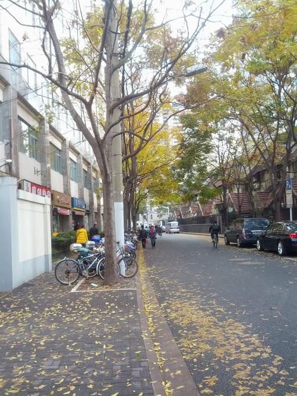

As you see, this is a road nearby the company. Everyday I need to commute though this road, but right now I have found another road that the distance is a litter bit small, so I have not go this road for a long time.

This morning, I take this picture,  it looks so nice, the feeling you know, a lot of leaves, falling in the wind and down to the ground, and the color is vivid. So it will recall some memory in the past when I was young.

So cherish everything what you have though you maybe have some troubles or worry about something special. That is ok, because you are healthy, and your family really love each other, that's enough.

 

