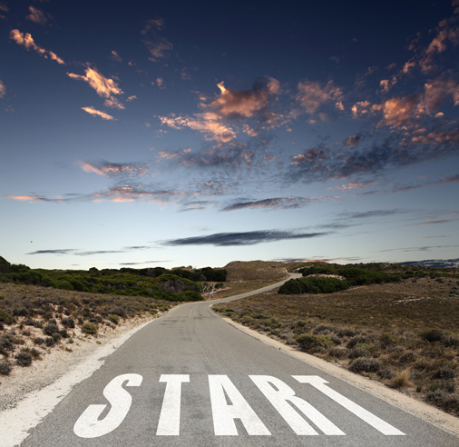

**起点或是终点**

从去年开始就喜欢上跑步了。
刚开始跑步时也谈不上喜欢，只是希望追求不一样的生活。当然这个说法其实是有点虚伪的，要的只是一个更高逼格的解释，要不就永远处于屌丝的底层。人们总希望为这样或者那样的生活找一堆的理由，我们可以说“存在即是合理的”，但更多时候这只不过是一种自欺欺人的自甘堕落的表现。

刚开始跑步时是孤独的。甚至不单单是刚开始时是孤独的，就算你一直跑一下，你也仍然是孤独的。孤独并不会随着你跑的越多而离开你，只是会从一种孤独升华成另外一种孤独。孤独是一种状态，也会随着你的汗水挥洒在每一个地方。从刚开始的100米，1000米，到后面的5000米，你都要努力的让自己的身体不再掉队，努力让自己超越刚才的自己。

当有一天，你漫无目的地跑着，感受到了日出和日落，感受到了寒风烈烈，感受了热浪袭人，也同样感受到了人来人往和车流的川流不息。在你身边的人换了一批又一批，人来了又走了，花开了又落了，一切都在不知不觉中自然地变换着，而你抬起头望望天，抹一抹额头上的汗水，继续坚定地往下跑下去了。

在一个清晨，周边是一大片地油油的草地，也许是昨晚下个小雨，也许是夜间湿气太重，草地上铺满了晶莹剔透的露珠，迎着阳光升起的地方，放出五颜六色的光芒。清新的让人陶醉的早晨，是梦开始的地方。早晨阳光的慵懒，微风拂面，踏着露珠，仿佛一切都是崭新的。我们无拘无束，放开了撒欢的奔跑着，露水湿了鞋子，凉凉的，自然的味道在这一刻弥漫开来，甜甜的。回头望望脚印，已经延伸到好远好远的地方了。

我们离开过一个又一个的起点，追逐着虚无缥缈的一个又一个的终点。但一次又一次，我们会发现，这些所谓的终来也只是我们的下一个起点。起点和终点的转换往往都会在一念之间。生活中没有永恒的终点，却有着永恒的起点。今天我们又站在一个全新的起点，迎接我们下一个终点的起点。

