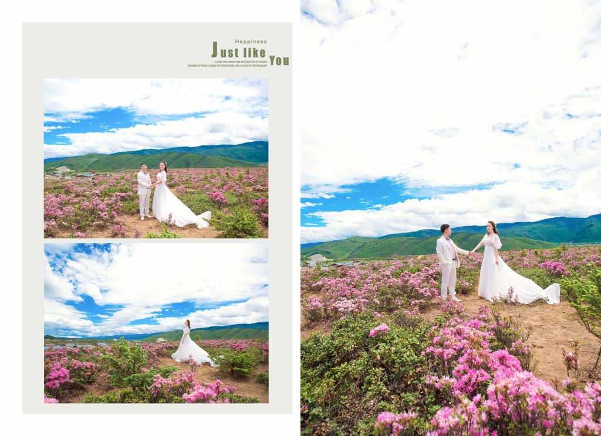

**2017年终总结**

[2009总结](http://pjq.me/?p=833)|[2](http://pjq.me/?p=833)[010年终总结](http://pjq.me/?p=898)|[2011年终总结](http://pjq.me/?p=993)|[2012年终总结](http://pjq.me/?p=1126)|[2013年终总结](http://pjq.me/?p=1249)|[2014年终总结|](http://pjq.me/?p=1280)[2015年终总结](http://pjq.me/?p=1318)[|](http://pjq.me/?p=1280)[2016年终总结](http://pjq.me/?p=1324)|[2017年终总结](http://pjq.me/?p=1355)

忙碌的2017年, 很快就要在不知不觉中过去, 和往年一样, 写点什么.

回顾过去的一年做了好多事情, 5月底去丽江拍了婚纱照，顺便玩了一圈，七月中找房子搬家，七月底去苏州领证，十一在家办摆的酒，还有持续了将近一年的驾照考试，终于在年底考过了科目三。许许多多的事情在一瞬间闪过，层层叠叠，原来2017完成了这么多的事情。

要说最近最流行的事，莫过于在朋友圈晒十八岁照了，当零零后都开始粉墨登场了，八零后又在哪里？看着各种略带泛黄的照片，在移动互联网时代重焕新生，曾经的记忆又有如一段新的旅程，穿越而来，是回顾，是展望，是伤感，是抹不去的那一丝丝梦想，激励着我们一步一步往前走。

**最好的时代，也是最坏的时代**

我们处在最好的时代，也是最坏的时代。

我们见证了新一代移动互联网的崛起。从2007年乔老爷子发布第一代iPhone开始，至今年已是十个春秋。而这十年间我们也刚好有幸目睹着这一天翻地覆的改变。而作为从业者，岂止是感同身受所能表达的。真的很幸运，从2008年就开始接触Android，到2009年正式转型为Android开发人员，到如今也已将近十个年头了。一步步看着Android的崛起，Nokia的没落，移动开发大行其道，再到如今人工智能的风起云涌。完整经历了一整个时代的更替，真的是可遇而不可求。笑看这过去的十年，煮酒论英雄，成王败寇，唯利而已。今天可以鲜花着锦，烈火烹油，明日就可能门前冷落，锒铛入狱，异或避于异国他乡。

吐嘈着盛，奈何又要吐嘈。细数几个关键词，大家定耳熟能详，大数据，云，云计算，物联网，智能家居，人工智能，AR/VR。曾几何时，甚或是当下，言不能提及，就觉已没面子。面子事大，叶公而好龙乎！关于面子，周树人先生早有论述，此不赘述。

**终生学习，终生淘汰**

回到2017年，感受最强的莫过于终生学习，终生淘汰。

最近中年油腻男，还有中年危机的概念闹得满城风雨，没有人能够独善其身。如果你身处于中年，对不起，你没办法逃避，如果你还没有到，那三五年之后，也将处于这个状态中，所以这些是我不得不面对的事情。我不希望成为油腻男，但我可以中年。危机这个东西，我觉得是相生相克的，只是没有像现在这么赤裸裸。尤其是今年华为的34岁清退，不管是不是谣传，但这个事情就好像一个定律，程序员一但进入34岁就会处于一个分水岭，无处可遁，而且很不幸的是，再过几年我也要面对这个坎。身处于一个毫无安全感的社会，谁又能超脱于事外呢？几年前，从来没有想过的问题，如今却不得不面对。

很早我就有树立终生学习的观念，学习的意义不在于你学到了什么，而在于能够养成好的学习习惯，与时俱进，终生学习。只是以前还没有想过与淘汰有什么关系。而如今淘汰也将成为与学习的另一个孪生兄弟，如影随形。不管曾经如何，在历史的车轮面前，淘汰都将是你不得不面对的另一个问题。

持续学习，终生学习，才可能与淘汰在并行的道路上相安无事。写给自己，也写给他人，2018大家一起学习。

**终身大事**

古语云，人生三大境界之一“金榜题名时，洞房花烛夜”，一朝缔结连理，终于在2017年完成了人生大事。在5月底，我们来到了美丽的丽江。

香格里拉，杜鹃花开，“待到山花烂漫时，她在丛中笑”，满山的杜鹃花，盛开在蓝天白云下，我们深深体会到了高原之上的秀色可餐。当时看似有点劳累，如今都成为了一幕幕美好的回忆。

**你好，2018**

2017年当然是忙碌的，但在忙碌之余，当然还有一件最重要的事情，我们的宝宝明年二月份就要到来到我们身边了，既兴奋又忐忑。目前还不知道是小公举，还是男宝宝，还有也不知道是属鸡还是狗，因为预产期是2.15, 正好是大年三十，只能说宝宝太调皮了，还有这么个悬念。

拥有一个小窝是全家人的梦想，当然这也是我们这代上永远的痛，国家机器面前，人如蝼蚁，不管你是信还是不信，我只能尽力去做到更好一些。

