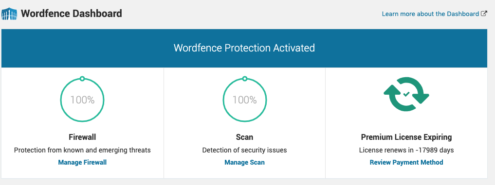

编辑wp-contentplugins/wordfence/lib/wordfenceClass.php， 添加下面的这段配置

```
`wfConfig::set('isPaid', 1);
            wfConfig::set('keyType', wfAPI::KEY_TYPE_PAID_CURRENT);
            !!wfConfig::set('isPaid', 1);
            !!wfConfig::set('keyType', wfAPI::KEY_TYPE_PAID_CURRENT);`
```

改好之后为

```
`	// Sync the WAF data with the database.
		$updateCountries = false;
		if (!WFWAF_SUBDIRECTORY_INSTALL && $waf = wfWAF::getInstance()) {
			$homeurl = wfUtils::wpHomeURL();
			$siteurl = wfUtils::wpSiteURL();
            // Add by Jianqing, 2019/04/02
            wfConfig::set('isPaid', 1);
            wfConfig::set('keyType', wfAPI::KEY_TYPE_PAID_CURRENT);
            !!wfConfig::set('isPaid', 1);
            !!wfConfig::set('keyType', wfAPI::KEY_TYPE_PAID_CURRENT);`
```

再次刷新Wordfence Dashboard

