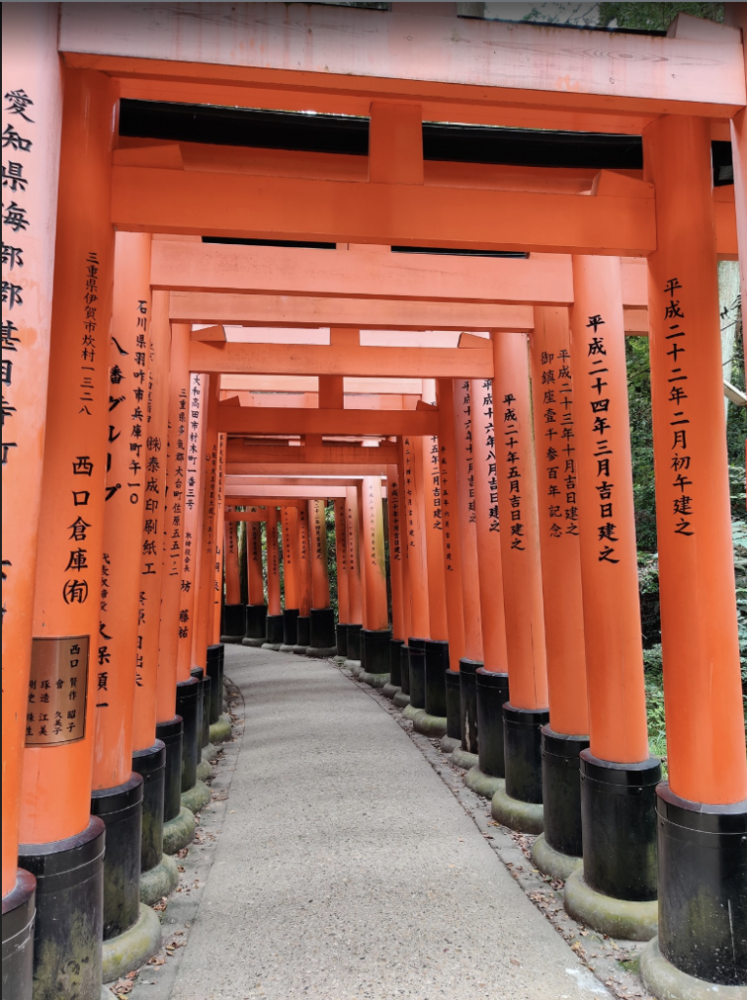
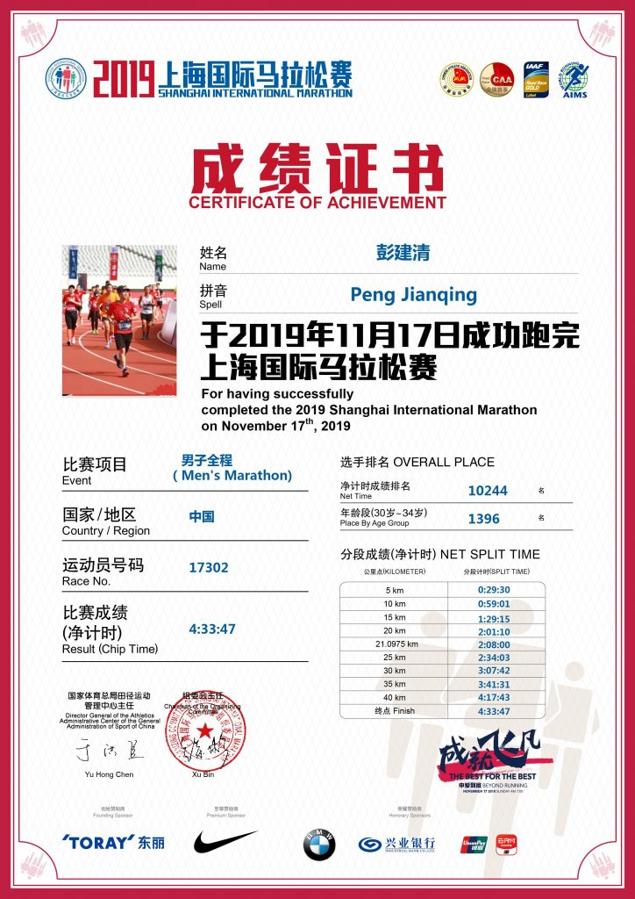
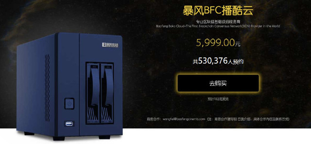

[09总结](http://pjq.me/?p=833)|[2](http://pjq.me/?p=833)[010年终总结](http://pjq.me/?p=898)|[2011年终总结](http://pjq.me/?p=993)|[2012年终总结](http://pjq.me/?p=1126)|[2013年终总结](http://pjq.me/?p=1249)|[2014年终总结|](http://pjq.me/?p=1280)[2015年终总结](http://pjq.me/?p=1318)[|](http://pjq.me/?p=1280)[2016年终总结](http://pjq.me/?p=1324)|[2017年终总结](http://pjq.me/?p=1355)|[2018年终总结](https://pjq.me/?p=1435)|[2019年终总结](https://pjq.me/?p=1523)

今年还是要写点什么，数下来已经算是第十一个年头了。

说到年底，今年应该是最近最热的一个冬天了，按照往年的习惯已经早就是寒气逼人了，而今年却有点冬天未过而春天已来的感觉，暖暖的冬日，晒着阳光，微风拂面，颇有春日暖阳的感觉。

工作十一年了，现在算起来已经是第五家公司了，也算是目前呆得最久的一家公司了。常言道，“铁打的营盘，流水的兵”, 一次又一次地重复着，而最近刚好也在经历着已往类似的情形。还记得9年前离职从苏州来到上海，当时有感慨，“相濡以沫，不如相忘于江湖”，十年过去了，兄弟姐妹们也都散落东西，有联系的，没联系的，后来就都断断续续的联系少了，时光匆匆流去，你还记得谁。

感慨完毕，书归正文，2019年还是有几件小事情可以拧出来说一下。

### 2019年4月21日

已经是连续第四年跑上半年上海半程马拉松了，从陆家嘴东方明珠下面出发，终点到东方体育中心，每一次出发其实都是不一样的感觉，时间在指缝间沙沙地流走，路在脚下一步步地跑着，这种特殊的仪式感记录着年复一年，偶尔翻翻照片就能知道时间都去哪里了。

而这一次，半马顺利PB到1小时45分钟，对于业余跑渣来说，配速能够保持在500(4:57)内已经是非常大的进步了，也算是实现了今年小小的一个目标。

### 2019年8月

这应该算是今年最重要的一件事，终于完成了漫长的居转户流程，历经各种磨难，也算是对多年努力办好居住证的最好的一个交待了。个中滋味也只有经历过才能懂得。居转户都能办下来，其它的各种东西就都不值一提了。人生就是各种打怪升级，不打打小怪，遇到大怪就只能避闪不及了。

### 2019年10月1日

正当国内一片祥和，为国庆生的时候，我正巧在霓虹国溜达。

京都，奈良，大阪8天自游行。

京都，也就是古代日本的首都，城市建立时，刚好是中国的唐朝，日本人从唐朝学习了大量先进的科学技术文化知识。所以在京都，看到那些古建筑，会有种乱入唐朝的感觉，随处可见的繁体字，对联，保存完整的寺庙，甚至中国古诗，直觉告诉你--好像梦回大唐了。

在日本见识到了各种神社。本以为中国人相信各种神，但在日本你会有种感觉，好像回到了各路神仙的大本营，日本人供奉着各种千奇百怪的神，而且都有模有样，就算是路边各种不起眼的石头，也都大有来头，而且“衣着得体”，实在叹为观止。

“艺术来源于生活而又高于生活”。也见到了千与千寻中各种神社的场景，在日本动漫中经常出现的各种“鸟居”，“神社”，来源应该都是这些保护的很完整的文物古迹。所以最后会感觉到有点羡慕，甚至是有点点嫉妒。

### 2019年11月17日

实在不可思议，我居然在这天跑完了全马。

而就在11月16日，我都在想着明天最多就跑个跑马然后就溜之大吉，一来是因为前段时间感冒太久，二来是原本就不打算去跑全马，都打算放弃了，虽然中签了，但也一直没有认直有系统的准备。因为毕竟是一个高强度的运动，没有充分的准备，还是不感轻易去跑的。

就在比赛前一个周末，才拉了个17km，比赛还有四天时跑了一个10km。然后准备随便跑一段就溜了，这个想法一直维持到跑步那天早上。

所以是不是很奇怪，最后我为什么还来能够全马跑下来？跑步的时候我定了一个策略，就是求慢，以6分钟的配速慢慢跑，如果我能够跑到20km，并且脚没有抽筋，脚踝膝盖也不疼的话，那我就可以继续往下跑。事实证明，我这个策略很正确，尽管当天温度上海马拉松史上最高，当我跑到21km的时候，身体并没有任何不适，这个时候我才决定，我可以继续跑一下。当然最后的几公里对任何人都是煎熬，地表25度以上的高温，大太阳照着，不断呼啸而过的救护车，能坚持下去的都是英雄。当跑进终点体育馆的一瞬间，你会觉得所有的一切都是值的。当然最后还是要敬畏马拉松，敬畏跑道，敬畏生命。

冲过终点的那一刻，你知道，你赢了。

### 2019年12月

终于入手了一台NAS, 暴风播酷云二期。其实这是2018年矿难发生之后的矿渣，当时的价格是5999，现在只卖650。j3455的CPU, 虽然要爆出来这个神u有个bug, 但个人用用估计问题还是不大的。

虽然最近大家都在叫着用NAS，但其实于我而言之前的小米路由器已经自带1T硬盘，一般自用就差不多已经够用了。而选择这个NAS纯粹是为了折腾用。

其实去电信宽带就已经免费从100M升级到了1000M，关键是上行速度升级到了100M，这就给了个人一些想象空间了。上传速度这么快，完全可以跑一台服务器用于外网访问，当然前提是需要有公网IP。于是在11月份在电信申请了公网IP，开通过程一波三折，但好在还是正常开通了。电信分配的公网IP其实是一个动态的IP，过一段时间就会换一个，所以自己弄了一个DDNS脚本，用来更新Godaddy的DNS配置，这样就可以在外面随意访问了。

刚开始我是在树霉派上安装了Seafile, 国内厂商做的一款个人Cloud Server软件，买了一张256G的TF卡插上，跑了一个月。树霉派是ARM CPU，要上它的Pro版本，需要是x86的，而且官方暂时也没有支持ARM上Pro的计划，再加上树霉派总是死机连不上，当然后来加了一个Wifi智能插座能够做到远程断电重启，但总归是有点麻烦的。所以总终想买一个x86的，低功耗的，能够24小时的硬件平台。选来选去就看中了暴风播酷云二期，期间也考虑完全自己DIY，考虑到这个性价比还是比较不错的，就在某鱼上入了一台。

系统是装的黑群，感觉自带的16G SSD有点烂，就又在闲鱼上入了一块二手的64G SSD，然后自己刷了黑群，目前来说运行稳定。网上的安装教程大都是基于Windows平台的，不适用，最后自己是找了一个U盘，dd了一Rescue LiveCD进去，然后再把黑群镜像dd到SSD。

后来又入了一块4T的东芝PMR盘，再奇迹般的复活了大概10年前的一块500G的台式机硬盘，最后还插上了一块2T USB 3.0的移动硬盘，然后24小时开机跑着。当然没有测过实际功率，不过应该还是可以接受的。

最后在公司实测上传速度可以达到60MB/S(480Mb/s)，下载可以达到12MB/S。

暴风播酷云长这个样子，买一台玩玩还是可以的。

### 2020已来

末来已来，让我们为梦想窒息:)

明天还要去上海国际赛车道参加"蒸蒸日上跑"，希望不要被关门。

### 附上马完赛视频