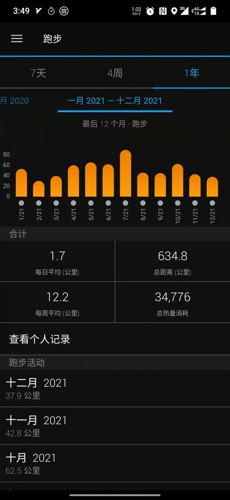

[09总结](http://pjq.me/?p=833)|[2](http://pjq.me/?p=833)[010年终总结](http://pjq.me/?p=898)|[2011年终总结](http://pjq.me/?p=993)|[2012年终总结](http://pjq.me/?p=1126)|[2013年终总结](http://pjq.me/?p=1249)|[2014年终总结|](http://pjq.me/?p=1280)[2015年终总结](http://pjq.me/?p=1318)[|](http://pjq.me/?p=1280)[2016年终总结](http://pjq.me/?p=1324)|[2017年终总结](http://pjq.me/?p=1355)|[2018年终总结](https://pjq.me/?p=1435)|[2019年终总结](https://pjq.me/?p=1523)|[再见2020](https://pjq.me/?p=1564)

今年是本命年，3个轮回忽悠一过，转眼就要奔四了，人都说四十不惑，而我正走在不惑的路上。

跌跌撞撞中，有得也会有失，心态也会收敛了许多，当然还是要保持对新鲜事物的好奇心。

## 感恩

一直从平凡中走来，再到平凡中去。

在大城市维持一个平凡的状态其实是殊为不易的。我们能够拼尽全身力气把日子过得普普通通，无大病无大灾，就已经是莫大的幸运。

靠自己努力写代码能在上海这个大城市，买房，结婚，生子，买车，我觉得已经比大部分人幸运了。选择在了一个还不错的行业，拿着比大部分行业高很多的工资，有时真不是你有多厉害，而是恰好这个行业目前处于不错的水平。有时想想，如果我去做其它工作会是什么样子，但肯定会比现在差很多。

人都是喜欢攀比的。比这个，比那个，活得很累。过几年之后再看看之前你在乎的，你关注的，可能真的就是过眼云烟。

珍惜当下拥有的是当前最应该做的事情，因为你永远不知道明天会发生什么。

## 压力

人在社会中总会有各种各样的压力，社会的，工作的，家庭的，生活的各式各样。学会舒缓身上的各种压力也变得越来越重要，可能最后压垮你的就是那根不经意的稻草。

缘于希望得到更多的东西，缘于对当前现状的不满，缘于画地为牢的禁锢，一个人在社会中苦苦支撑。

21，22年注定是不一样的两年，疫情夹杂着各种不曾蒙面的压力接踵而至，也许这就是心态蹦了的前奏。

在外企养老已5年，还不知道能呆多久，社会上各种甚嚣尘上的关于程序员34的宿命论不绝于耳，于已，于当前社会的大环境都是很难独善其身的。

“我自横刀向天笑，去留肝胆两昆仑”，我也只能摆摆手，有家要养，其它一切都是浮云。

端起镜子，看着镜子中的自己，竟感到熟悉而又陌生，脸上若隐若现的白斑是最近心头隐隐的痛，熬的眉毛都半白了。

下一个失业的会是自己吗？说实话没人能够回答这个问题。学不动了，学习能力退化变得越来越清晰，不禁打了个寒战。

社会的焦虑，在肆意传导，永远没有要停下来的迹象，挥之不去。

这也许就是最好的时代，但也是最坏的时代。

## 期许

工作多年，一切皆平淡，未来并不可期，不想着大富大贵，只求温饱裹腹，一家和睦。