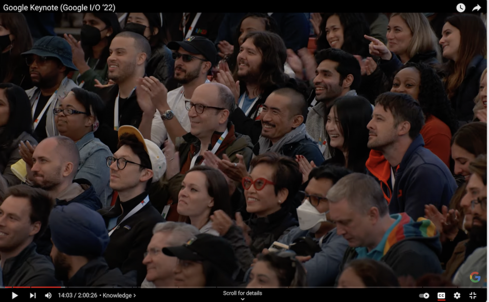

在上海的封控中，突然就到了新一年的Google IO。

今年可能是对Google IO关注度最低的一年，以前都会半夜守着看直播Keynotes，现在对Google IO关注度降低了好多，再加上最近两个月接近奔溃状态的上海封城，也无暇顾及其它事情了。

记录一下今年Google IO倒不是说它有多精彩，而是在后疫情下，经历2020，2021线上的Google IO，今年Google IO又回到了线下举行，这个显得尤为珍贵，就感觉在一个封闭的牢笼中呆了很长时间，突然能够透过一扇窗户，看到外面的精彩世界，在分裂的现实世界中，每一天都是煎熬，看不到未来，看不到方向，各种错乱，嘈杂，反智，这种时候急需有一着手能够拨云见日，而这个期盼，在慢慢的消磨中也就变成了一种可见而不可及的奢求。

看Google IO还是要看视频，总结性的文本到处都是，但整体氛围都丢掉了。而看视频给我最震憾的是，摄像头掠过人群，熟悉的人群，熟悉的人类的脸，熟悉的微笑，一切都好像回到了原来的样子，真实。

而这是在家封闭两个月的煎熬中，很独特，很唯一的一种感觉，就晃如两个世界。

而这，真的就是两个世界

