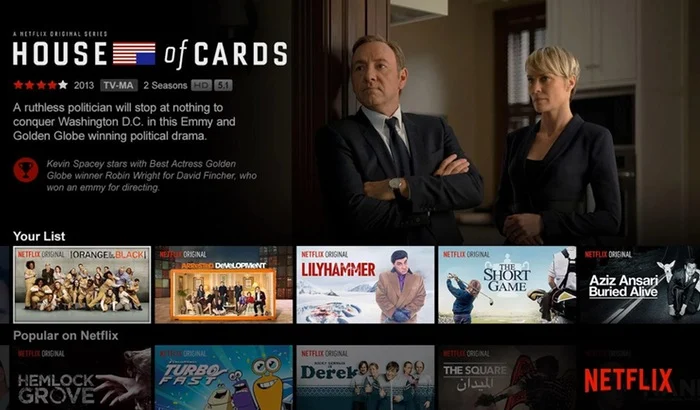
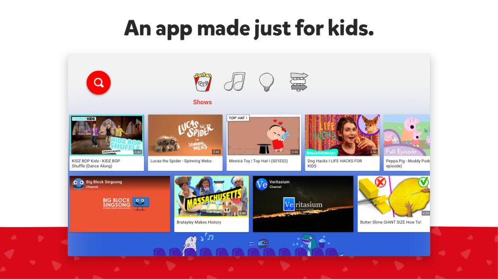
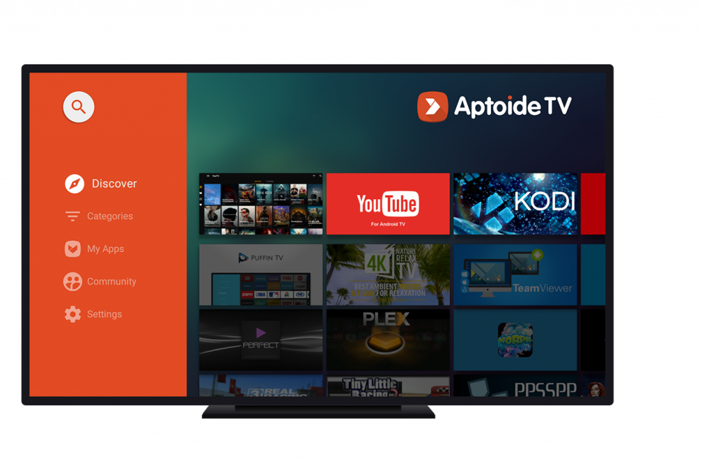

If you're using the Android TV in China, it will be very likely the Google Service has been removed, and you can't use/login the Youtube or Google Play(TV Version).

## Prerequisites

For all the Google Apps or Netflix App, you need to have the Free Internet Connection to access all those Websites due to the so-called stupid reasons, otherwise you can't use all those Apps or service, it's ridiculous.

## SmartTube TV

Almost two years ago, I found one open source App called SmartTube TV,  it can be used without the GMS, and also you can login with your Google Account, so it will be top1 Android TV App I want to recommend.

- https://smartyoutubetv.github.io/

## Netflix

The second one will be the Netflix, and you can Google Netflix Android TV APK, and installed to you Android TV. And for save my money, I bought the sharable account from Xianyu/Taobao, it's really cheap, only cost 

## Youtube Kids

I have one kids, so I want to install the Youtube Kids on my Android TV. And I find the Youtube Kids Android TV App doesn't depend on the Google Service, and it can login successfully without the GMS, it's really interesting and convenient, what you need to do is Google the APK, download it, then install it.

- https://play.google.com/store/apps/details?id=com.google.android.youtube.tvkids&hl=en_US&gl=US

## Aptoide TV

That's App is just recently I got to know, you can call it the 3rd party Android TV Appstore, and it has tons of Android TV App from all the global world, so you can install whatever your want to your Android TV, e.g. Netflix, SmartTube without download the APK manually.

- https://tv.aptoide.com/howtoinstall.html

