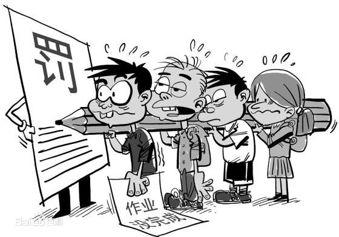

从小到大，经常在电影作品中，听到或者看到连坐制，比如--诛连九族，但毕竟只是在历史类的影视剧中。

而现今真的是"历史照进现实"，从今年上海疯狂的惨绝人寰的封控，到如今看似有点松的迹象，其间看到的，听到的，亲身检验到的，只能说真的是魔幻现实主义的落地。

然作为幼儿园的家长，也只能是砧板上的鱼肉，任人宰割，美其名曰--为了幼儿的健康，一天六检，天天不重样。而这一切有科学基础吗？

德先生和赛先生都引入中国100多年了，而这又是一次历史的完美复刻。

历史总是惊人的相似，轮回，一轮又一回，想躲也躺不过。

我们都说“孩子是祖国的花朵”，又说“不经历风雨怎么见彩虹”， 所以祖国的花朵就是要从小经历风雨，才能看到彩虹，而这个风雨也是祖国给的，你必须心甘情愿，并且感恩戴德。

作为家长我是懦弱的，心中的小算盘，那些许的小心思，它们早已洞若观火，一纸空文，你只能三缄其口，空留下满腔愤怒。

假借教育之。名，将学生和家长圈禁，而你除了愤怒还是愤怒，但却无可奈何。

这不，又来更新同住人信息了，连坐制的生动演绎，又一次在历史的枝头绽放。