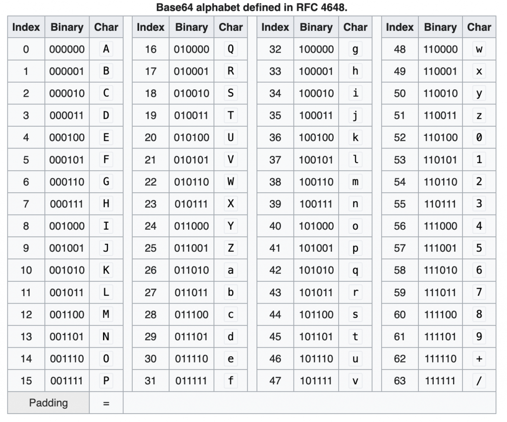
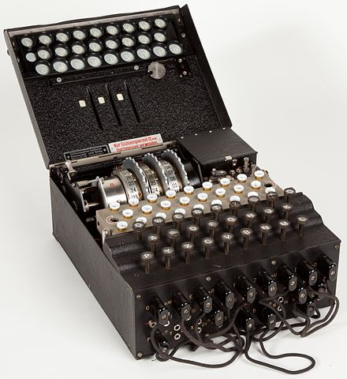

I am start to learn the cryptography, so I will note the Cryptography journey in my blog

## Online resources

Some Cryptography online courses

- [https://www.pluralsight.com/search?q=Cryptography](https://www.pluralsight.com/search?q=Cryptography)

Online hack platform

- [https://cryptohack.org/courses/](https://cryptohack.org/courses/)

## China Cryptography Cipher

SM4, one China Block Cipher

- [https://en.wikipedia.org/wiki/SM4_(cipher)](https://en.wikipedia.org/wiki/SM4_(cipher))

> 

**ShāngMì 4** (**SM4, 商密4**) (formerly **SMS4**)[[2]](https://en.wikipedia.org/wiki/SM4_(cipher)#cite_note-oscca_1228-2) is a [block cipher](https://en.wikipedia.org/wiki/Block_cipher) used in the [Chinese](https://en.wikipedia.org/wiki/China) National Standard for Wireless LAN [WAPI](https://en.wikipedia.org/wiki/WLAN_Authentication_and_Privacy_Infrastructure) (WLAN Authentication and Privacy Infrastructure) and also used with [Transport Layer Security](https://en.wikipedia.org/wiki/Transport_Layer_Security).[[3]](https://en.wikipedia.org/wiki/SM4_(cipher)#cite_note-3)

## CIA of Triad of InfoSec

- Confidentiality

- Integrity

- Availability

## Vocabulary

- Cryptography

- Cryptanalysis

- Cryptology = Cryptography + Cryptanalysis

- Steganography:Writing messages,such that no one else notices that they have been written.

**Not Crypto**

- Encoding, e.g. md5, Base64, Base32, UTF-8

Hierarchy of Cryptology

```
`Cryptology = Cyptography + Cryptanalysis
Cryptography = Cyptographic Hash Algorithms + Symmetric Key Algorithms + Asymmetric Key Algorithms + Protocols`
```

## CyberChef

Lots of useful tools

- [https://gchq.github.io/CyberChef](https://gchq.github.io/CyberChef)

## Base64

Base64 

- [https://en.wikipedia.org/wiki/Base64](https://en.wikipedia.org/wiki/Base64)

E.g. Hello, so split it as 6 bit as one group, and mapping to the Base64 table, the last 00 is padding

```
`01001000 01100101 01101100 01101100 01101111
010010 000110 010101 101100 011011 000110 1111(00) (=) 
S      G      V      s      b      G      8
SGVsbG8=`
```



## Caesar Cipher

- https://en.wikipedia.org/wiki/Caesar_cipher

In general it shift right the number of the Character

Math behind, e.g. shift 3.

```
`E(p)→(p+3)mod26

D(c)→(c-3)mod26=(c+23)mod26`
```

- [https://cryptii.com/pipes/caesar-cipher](https://cryptii.com/pipes/caesar-cipher)

- https://gchq.github.io/CyberChef/#recipe=ROT13(true,true,false,2)

Use the online tool to encypt the message with Caesar Cipher

E.g. PlainText, shift = 2

```
`Star Wars is an American epic space opera[1] media franchise created by George Lucas, which began with the eponymous 1977 film[a] and quickly became a worldwide pop culture phenomenon. The franchise has been expanded into various films and other media, including television series, video games, novels, comic books, theme park attractions, and themed areas, comprising an all-encompassing fictional universe.[b] Star Wars is one of the highest-grossing media franchises of all time.`
```

```
`Uvct Yctu ku cp Cogtkecp grke urceg qrgtc[1] ogfkc htcpejkug etgcvgf da Igqtig Nwecu, yjkej dgicp ykvj vjg grqpaoqwu 1977 hkno[c] cpf swkemna dgecog c yqtnfykfg rqr ewnvwtg rjgpqogpqp. Vjg htcpejkug jcu dggp gzrcpfgf kpvq xctkqwu hknou cpf qvjgt ogfkc, kpenwfkpi vgngxkukqp ugtkgu, xkfgq icogu, pqxgnu, eqoke dqqmu, vjgog rctm cvvtcevkqpu, cpf vjgogf ctgcu, eqortkukpi cp cnn-gpeqorcuukpi hkevkqpcn wpkxgtug.[d] Uvct Yctu ku qpg qh vjg jkijguv-itquukpi ogfkc htcpejkugu qh cnn vkog.`
```

You can try to decode it with the online tool

- https://www.dcode.fr/caesar-cipher

## Letter frequency

- [https://en.wikipedia.org/wiki/Letter_frequency](https://en.wikipedia.org/wiki/Letter_frequency)

- E: 12.7%

- T: 9.1%

- A: 8.2%

We can using the tool

- [https://gchq.github.io/CyberChef/#recipe=Frequency_distribution(true,true)](https://gchq.github.io/CyberChef/#recipe=Frequency_distribution(true,true))

In the movie, it's using the frequency analyse

- [https://en.wikipedia.org/wiki/The_Adventure_of_the_Dancing_Men](https://en.wikipedia.org/wiki/The_Adventure_of_the_Dancing_Men)

## Substitution Cipher

- [https://en.wikipedia.org/wiki/Substitution_cipher](https://en.wikipedia.org/wiki/Substitution_cipher)

## Pigpen Cipher

- [https://en.wikipedia.org/wiki/Pigpen_cipher](https://en.wikipedia.org/wiki/Pigpen_cipher)

CodeBook


## Kerckhoff's Principle

- [https://en.wikipedia.org/wiki/Kerckhoffs%27s_principle](https://en.wikipedia.org/wiki/Kerckhoffs%27s_principle)

> 

Kerckhoffs' Principle states that **the security of a cryptosystem must lie in the choice of its keys only; everything else (including the algorithm itself) should be considered public knowledge**.

## Enigma Machine

- [https://en.wikipedia.org/wiki/Enigma_machine](https://en.wikipedia.org/wiki/Enigma_machine)



## Railfence cipher

- [https://en.wikipedia.org/wiki/Rail_fence_cipher](https://en.wikipedia.org/wiki/Rail_fence_cipher)

You can play on the CyberChef

- [https://gchq.github.io/CyberChef/#recipe=Rail_Fence_Cipher_Encode(4,0)&input=VGhpcyBpcyBhIHNlY3JldCBtZXNzYWdl](https://gchq.github.io/CyberChef/#recipe=Rail_Fence_Cipher_Encode(4,0)&input=VGhpcyBpcyBhIHNlY3JldCBtZXNzYWdl)

And decode

- [https://gchq.github.io/CyberChef/#recipe=Rail_Fence_Cipher_Decode(2,0)&input=VHNjZWhpIGVybXNlaSBhc2Ugc2dzIHRh](https://gchq.github.io/CyberChef/#recipe=Rail_Fence_Cipher_Decode(2,0)&input=VHNjZWhpIGVybXNlaSBhc2Ugc2dzIHRh)

## Playfair Cipher

- [https://en.wikipedia.org/wiki/Playfair_cipher](https://en.wikipedia.org/wiki/Playfair_cipher)


## Shannon's Principle for Secure Ciphers

Confusion

> 

Each bit of the ciphertext should depend on several parts of the secret key.

Diffusion

> 

Changing only one bit of the plaintext should change (approximately)half the bits of the corresponding ciphertext.

We can use the CyberChef to testing, if key changed or plain text changed

- [https://gchq.github.io/CyberChef/#recipe=AES_Encrypt(%7B'option':'UTF8','string':'0000000000000000'%7D,%7B'option':'Hex','string':''%7D,'ECB','Raw','Hex',%7B'option':'Hex','string':''%7D)&input=MDAwMDAwMDAwMDAwMDAw](https://gchq.github.io/CyberChef/#recipe=AES_Encrypt(%7B)