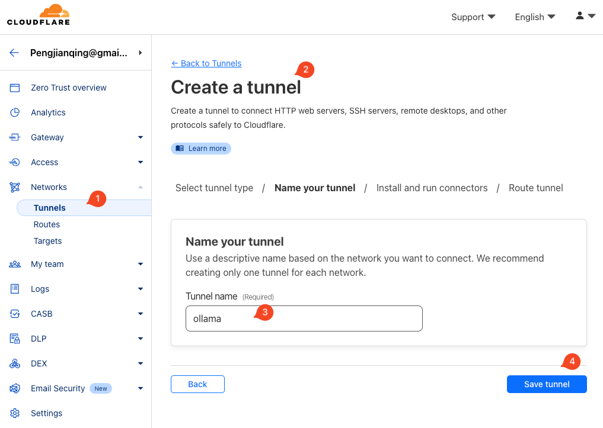

## Create tunnel

First create one Tunnel in the Web Dashboard

- Networks->Tunnels->Create a tunnel



Then install the cloudflared on Mac

```
`brew install cloudflared && 

sudo cloudflared service install eyJhIjoiNGNkZWY4xxxxx.......`
```

## Update the Public Hostname

After you finished the cloudflared installation, then you can update the "Public Hostname", which means when you visit the subdomain, Cloudflare will forward the request to the local server, e.g.

- https://ollama.pjq.me -> http://localhost:11434


It's very interesting to see the tool have one special params '--post-quantum', well, Cloudflare it's already consider about the post quantum secure connection, so I suppose they already integrate some special encryption algorithms.

```
`--post-quantum, --pq When given creates an experimental post-quantum secure tunnel (default: false) [$TUNNEL_POST_QUANTUM]`
```