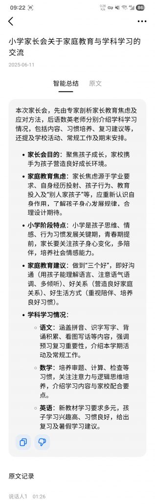
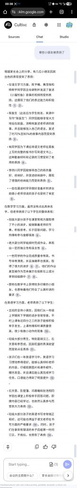

昨天参加了小朋友小学一年级下的家长会，家长会共两个小时。

出于无聊，打开了手机录音，然后才有了下面这些偿试

- 把音频发给豆包，豆包居然直接把音频转好了文字，还给了总结

- 把文字Copy到Google NotebookLM

- 直接生成了播客对话

- 生成思维导图

- 直接和家长会内容进行对话

整个过程很丝滑， NotebookLM果然是最强AI应用之一，生成的思维导图很准确，播客音频对话抓住整个家长会的重点，瞬间就有了一个家长会的助手，可以访谈任何内容。

