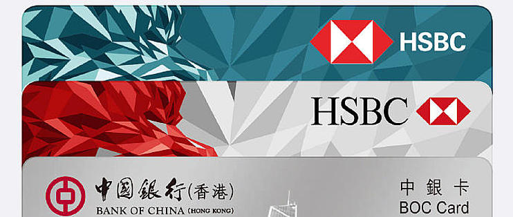

在国内A股做了很多年的小韭菜，趁着最近A股上涨，清仓走人。

趁着8月底去深圳，顺便去了一次香港，线上申请开通了

- 中银香港

- 汇丰One

- 众安银行

- 天星银行

中银，众安，天星开通都挺快的。

汇丰线上开通没有直接通过，等了几天才收到"Say Hello"邮件。再往后就是漫长的等待密码函，大概10.8从深圳回上海，在楼下信箱里面，终于收到了密码函，马上打客服电话+85222333000申请激活银行卡，然后在客服的帮助下尝试激活登录HSBC Mobile App, 折腾了46分钟无果。看来客服也对这些流程不是特别清楚，后来查到这个需要等到银行卡激活之后才能激活登录。

终于在10.13晚上，我无意中尝试激活登录，居然成功了，但我之前并没有收到任何银行卡激活的短信，于是顺便申请了汇丰万事达扣账卡(俗称汇丰蓝狮子, MasterCard, 无法透支的信用卡)，不知道哪天能够收到这个银行卡。

至此我集齐了5张银行卡

- 中银香港银行卡

- 中银香港万事达扣账卡

- HSBC One(汇丰红狮子)

- HSBC万事达扣账卡(蓝狮子)

- 众安Visa实体卡

简单记录下每张卡的作用

## 中银香港银行卡

中银香港银行卡是一张银联卡，香港本地取现免手续费，我发现它最大的好处是支持eDDA入金盈透

目前我跨境支付通都是汇到这张卡上，FPS绑定手机号，所以跨境支付通，只需要输入我的境内手机号就可以直接汇款。

## 中银香港万事达扣账卡

中银香港万事达扣账卡是一张特殊MasterCard信用卡，和汇丰蓝狮子类似，不能透支的信用卡，除中国大陆和香港外的万事达ATM取现免手续费，消费返0.5%

## HSBC One(汇丰红狮子)

这张卡需要配合兴业银行寰宇人生银行卡使用，国内可以通过寰宇人生银行卡免手续费无损汇到HSBC One，除此之外暂时没发现什么特别的地方.

## HSBC万事达扣账卡(蓝狮子)

HSBC万事达扣账卡(蓝狮子)，和中银香港万事达扣账卡类似，但只有在汇丰ATM取现免手续费，消费返0.4%

## 众安Visa实体卡

众安的手机APP做的挺不错的，这张实体卡暂时应该没有太多作用。

## 天星银行虚拟卡

最大的好处是汇率兑换最划算，所以要RMB兑换港币，美元，可以通过天星银行

## 兴业银行寰宇人生银行卡

这是新开的境内兴业银行卡，在跨境支付通开通前，这是一张神卡，可以跨境汇款到汇丰银行，无损，无手续费，但现在有了跨境支付通，这张卡的作用就小了，但这张卡还有个好处是境外取现免手续费，而且汇率很不错

- 境外取现免手续费

- 汇率最好

- 支持免费无损跨境汇款到汇丰银行香港

所以这么多银行卡，每张卡的用途都有些不一样，如果去香港的还是尽量多开几张卡。

同时我也开通了Wise, 现在暂时没发现有什么作用。