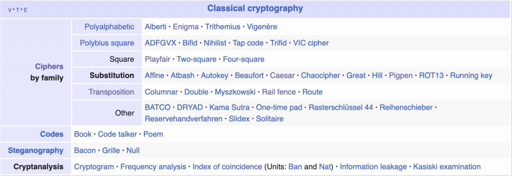
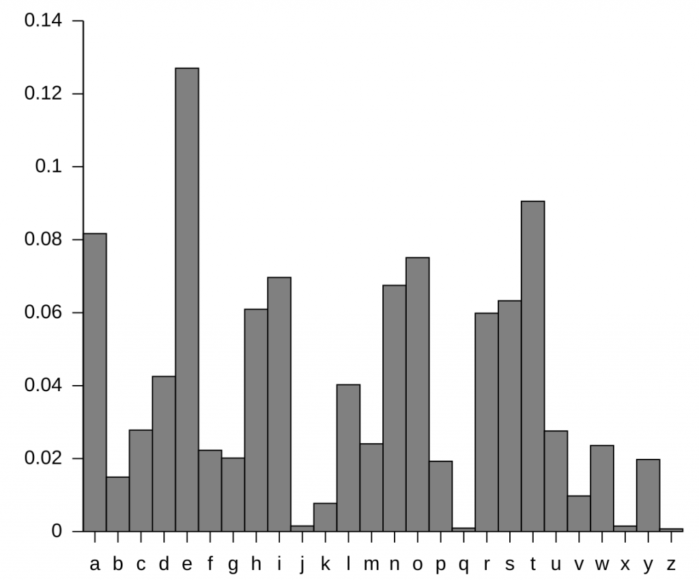
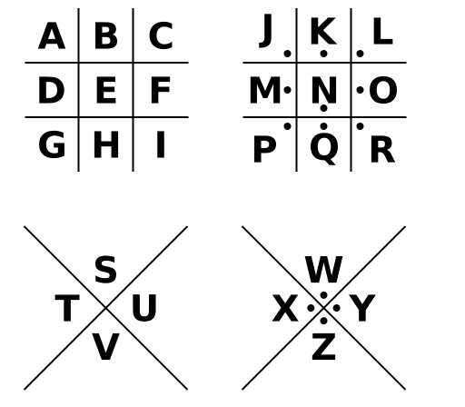
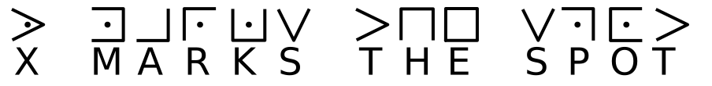
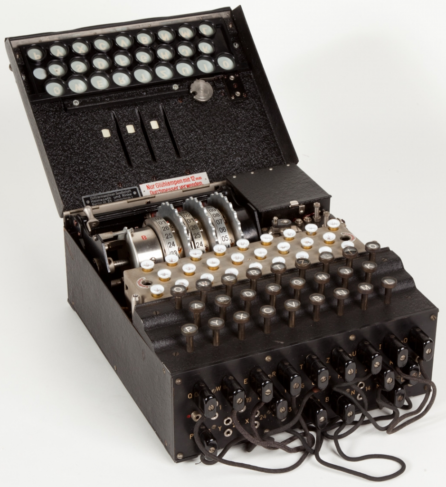
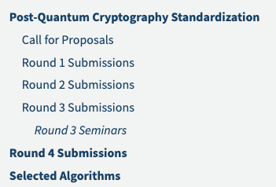

最近一直在看密码学相关的知识，虽然一年前已经看过了，但一段时间没用了，就容易忘记。

所以想在这里写一篇密码学简史，顺便梳理一下相关知识。

密码学对普通人来讲，看起来是很高深的，但实际情况是每天大家都要用到大量密码学的算法。只要你在用手机电脑上网，购物，聊天，那就一定会有很多密码学相关的算法在后面默默地工作着，这些幕后英雄在偷偷地保障着你在数字时代，你的隐私不被窃取，你的聊天记录不会被人看到，你的银行密码不会被人抓到。

每次你在App里面发起一次购物请求，在聊天App里面发出“你好”，后台有大量的加密算法在默默地运行。

而在这里我想慢慢地给大家解释清楚这后面所发生的一切。

密码学简单来说就是把你说的话，发的消息进行各种转换，就算别人看到转换之后的内容，也无法看到你真实说了什么。

所以这里你会第一次接触到两个概念

- 明文(PlainText)：就是你真实说的话，发的消息

- 密文(CipherText)：就是经常各种转换内容，别人第一次看到时会一脸懵，不知道具体是什么

大道至简，简单粗暴。

人类的文明史，其实也是密码学的演进史，人类从古至今，其实都是一直在追求如何将明文进行各种转换，变成密文，而不被变人知晓真实内容。

当然魔高一尺，道高一丈，你越是进行各种转换，别人就越想知道，经过几百年，上千年的迭代演进，攻防转换，渐渐地形成了密码学(Cryptography)的概念。

## 密码学分类

一般可以分为古典密码学(Classic Cryptography)和现代密码学(Modern Cryptography), 分类标准其实也很简单，大概以时间为界，比如1970年以前叫古典密码学，1970年之后就是现代密码学。

## 古典密码学(Classic Cryptography)

假设你在古代，你不想让别人看到你写的消息，你该怎么做？

最先想到的可能就是对发的消息进行替换？

比如：今天晚上发起攻击

我们可以进行简单替换：“后天早上回家吃饭”

- 今天-后天

- 晚上-早上

- 发起-回家

- 攻击-吃饭

当然这里只是为了描述这个概念，感兴趣你完全可以自己弄一个对照列表，只有知道这个对照表的人才能解读出真实内容。

或者我们对它的顺序进行各种打乱: 晚发上攻今起天击，而这个顺序对应表只有你知道。

上面这个例子其实就是一种朴素的古典密码学的加密方法：替换密码([Substitution Cipher](https://en.wikipedia.org/wiki/Substitution_cipher))。

好了，现在你对古典密码学有了一些基本的概念，它是根据一些经验，手工设计出来的，甚至每个人都能根据一些想法设计出自己的密码。

那历史上又出现过哪些比较有名的加密方法呢，这里我直接截图的维斯百科上对古典密码学的总结归类。



其实真的是百花奇放，各种分门别类，这里我总感觉应该只是收集了一些传播范围比较广的一些加密方法。

## 凯撒密码 (Caesar Cipher)

我们可以拿一些来看看，进行一些更深入的了解，比如[凯撒密码 (Caesar Cipher)](https://en.wikipedia.org/wiki/Caesar_cipher)，它是出现在公元前58年，所以历史真的够久。

它的加密过程其实很简单，就是字母进行平移，比如说每个字母往前移动3位进行替换。


```
`明文: HELLO WORLD
密文: KHOOR ZRUOG`
```

看起来很简单对吧，实际上也是很简单，当然这是以现代人的视角来看，英文字母只有26个，那其实只要暴力偿试移到25次，你就一定能在某一次看到真正的内容。

这里的25次，还有一个叫法是密钥空间大小，也就是我们要暴力破解穷举的次数。

凯撒密码有一个比较有名的变种：[ROT13](https://en.wikipedia.org/wiki/ROT13)，看名字就知道，位移13次，比如说你想在一些论坛上需要对你发的消息做一些简单的处理，就可以用ROT13进行简单的变换。

这种替换密码，在实际过程中也可能用[频率分析(Frequency Analysis)](https://en.wikipedia.org/wiki/Frequency_analysis)进行破解, 英文字母实际在使用过程中是有一个[频率分步表](https://en.wikipedia.org/wiki/Letter_frequency)的，比如e:12.7%, a: 8.2%.



替换密码里面有一个比较好玩的叫[猪圈密码(Pigpen Cipher)](https://en.wikipedia.org/wiki/Pigpen_cipher), 这把每个字母都放在不同围栏中，这每个围栏看起来就像猪圈一样，把每个字母围起来了，



再用每个围栏来代码真实的字母



看到这些图形是不是很有趣。

## [栅栏密码(Rail Fence Cipher)](https://en.wikipedia.org/wiki/Rail_fence_cipher)

古典密码学里面，还有一些好玩的比如[栅栏密码(Rail Fence Cipher)](https://en.wikipedia.org/wiki/Rail_fence_cipher)

顾名思义，它是把明文按栅栏那种排列方式依次放入，比如，这是一个三行的栅栏：WE ARE DISCOVERED. RUN AT ONCE

```
W . . . E . . . C . . . R . . . U . . . O . . . 
. E . R . D . S . O . E . E . R . N . T . N . E 
. . A . . . I . . . V . . . D . . . A . . . C . 
```

依次放人，从上到下，从左到右，放好之后，我们再按行数把所有的字母拼起来

```
`WECRUO ERDSOEERNTNE AIVDAC`
```

这样我们拿到了密文，看起来不知道说的是什么。

## Playfair Cipher

普莱费尔密码[Playfair Cipher](https://en.wikipedia.org/wiki/Playfair_cipher)，由Charles Wheatstone在1854年发明，但以他的朋友Lyon Playfair的名字命名。它在历史上被广泛用于军事通信。具体可能参考维斯百科说明

- https://en.wikipedia.org/wiki/Playfair_cipher

这里我们列举了一些常见的古典密码学算法，当然以现在的视角去看，可能比较弱，但是放在当时的技术水平，还是能发挥很大的作用的，有很多实际意义，现在我们在理解密码的时候都会去回顾一下，历史上的人们是如何创建各种加密算法。

## 恩尼格玛密码机(Enigma Machine)

其实在二战的时候就已经发明了一些更高级的密码机：恩尼[格玛密码机(Enigma Machine) ](https://en.wikipedia.org/wiki/Enigma_machine)



这个我也有搞清楚怎么运行的，但后来这个机器加密算法被破解了，而且有相关电影专门讲Enigma，我记得好像看过其中一部电影，里面有图灵，但忘记叫什么名字了。

后来查找了一下就是The Imitation Game (2014)，讲的是二站期间图灵破解德国Enigma加密算法的故事，再后来图灵基于此发明了计算机。

## 现代密码学

与古典密码学相对的就是现代密码学，从我们感知上，古典密码学很多是根据一些生活或者工作经验设计出来了，甚至说每个人都可以设计自己独立的加密方式。但现代密码就要求很多，需要更高的安全性，保密性，完整性校验，然后需要基于某些数学理论基础，能够从理论上被验证的一数学难题。

- 大整数的因式分解(Integer Factorization)

- 离散对数问题(Discrete Logarithm, DLP)

- 椭圆曲线问题(Elliptic Curves)

后面我们再写关于对称加密和非对称加密的内容，详细解读人类在加解密上，螺旋式攻防迭代上升过程。

应该说整个密码学是当今数字世界，互联网的基石，如果密码学被攻破了，那么整个现实世界都有可能坍塌，就比如现在的量子计算机，就对现在的这些加密算法造成了威胁，所以美国NIST一直在准备后量子计算机时代的加密算法(PQC)

- https://csrc.nist.gov/projects/post-quantum-cryptography

2025年3月11日，PQC时代加密算法经过轮竞争，最终被选取出来了。



这篇就到这里结束了，后面文章再详细介绍。