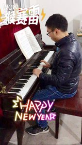

**2016年终总结**

[2009总结](http://pjq.me/?p=833)|[2](http://pjq.me/?p=833)[010年终总结](http://pjq.me/?p=898)|[2011年终总结](http://pjq.me/?p=993)|[2012年终总结](http://pjq.me/?p=1126)|[2013年终总结](http://pjq.me/?p=1249)|[2014年终总结|](http://pjq.me/?p=1280)[2015年终总结](http://pjq.me/?p=1318)[|](http://pjq.me/?p=1280)[2016年终总结](http://pjq.me/?p=1324)

心里默默地数了一下，已经是第八年了，八年的时光过去了，你是否还记得刚出校门的时的青春懵懂。 曾经的你，刚毕业时就遇上金融危机，之后又遇到各种百年一遇，甚或是千年一遇的事。时光之轮总是滚滚向前，一次一次的重复着轮回，若干年后，再回首，曾经的荒唐，已然成为了茶余饭后的谈资。

**健康**

健康永远是最重要，不论是现在，还是将来，身体永远是革命的本钱，关注健康，永远都不嫌晚。2013年初的那段经历，让我开始跑步，今年虽然也一直坚持着，但并没有跑多少，这样或那样的原因，让本就微不足道的一点跑量，显得尤其可怜。希望来年能够锻炼多一些，穿上跑鞋永远比你计划跑多远更重要。就在昨天，妈妈再次做了手术，希望以后全家人都健健康康的，只有经历让人成长。

**工作**

离开了呆了三年的EF，加入了SuccessFactors。在EF的三年，是职业生崖中最另人赏心悦目的三年。一帮同事，一帮朋友一起工作，一起玩耍，一起研究各种新奇的技术。技术之外还有很多东西值得关注。后来大家又一起来到了张江，现在又结交了一帮新的同事，新的朋友。在外企，追求生活和工作的平衡，不知道从什么时候起，被国内很多互联网公司嗤之以鼻，貌似九九六才是大家的终极目标。当然，我们还是无法逃脱工作内容的无聊，工作多年之后，要学会取舍，任何工作都有好的，也有坏的。要学会分配有限的时间，保持对新事物的好奇心，永远相信这个世界永远不变的就是变化。关注协作，关注怎样说服别人，应该是接下去要学习的，虽然有时候觉得很浪费生命去争论一些看似无聊的事情，但世界就是这样的，我们终究无法独善其身。

最近一年，有点焦虑，有时候不知道接下去会怎么样，也不知道自己能怎么样。感觉遇到了一个坎，焦虑会让自己迷失自己，迷雾尽头，终将是彼岸另一个自己吗？

**生活**

一只猫，两个人。

生活不只有苟且，还有带着猫咪咪去逛公园。每天早晨，不时地被一个大大的圆脸凑到脸边呼呼地叫醒，你就想一把把它抓过来塞到被窝里。毛铺满了整个屋子，软软的。

宫崎骏的童话世界，每天都变着法儿来到我的身边，久石让的精典旋律，充满了整个屋子。路飞，索隆，娜美，带我开启了一段新的大航海历程，在伟大航路上寻找着终极宝藏。一路上都是你的名字，在慧星来临时，渴望遇见另外一个淘气的你。

2017已经到了，今年将是精彩的一年，忙碌的一年，祝我和我爱的人新年快乐，幸福安康。
