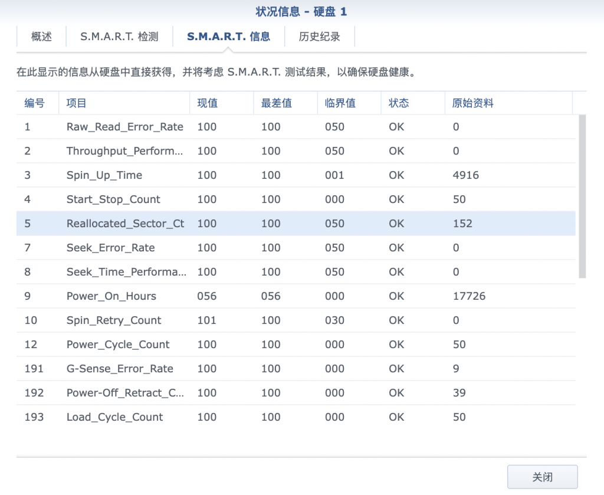
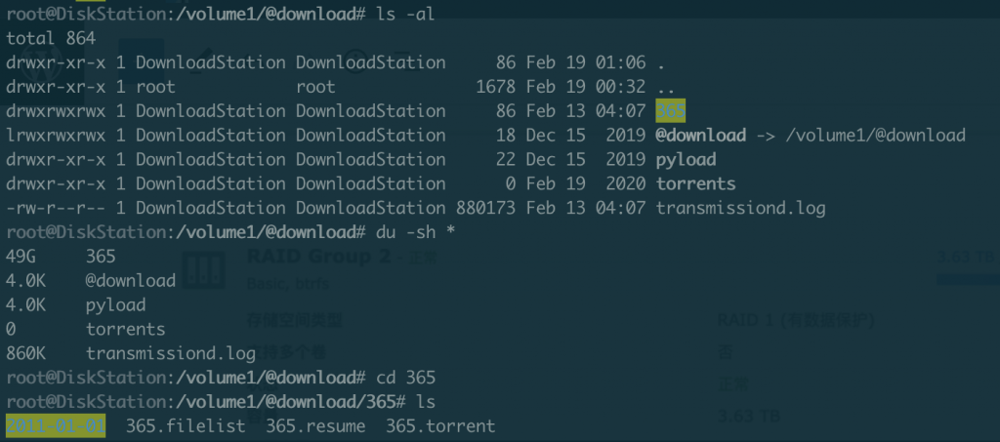

今天黑群提示硬盘坏道，然后启用了USB Copy, 过不多久，Web访问提示


## ssh  查看当前进程

```
`root@DiskStation:/etc/init# ps -ef|grep cgi
root     10216     1  0 Dec01 ?        00:03:03 synoscgi
root     11754     1  0 Dec01 ?        00:00:03 /usr/syno/sbin/synocgid -D
system   13200 10216  0 09:45 ?        00:00:00 synoscgi
root     18462 21822  0 09:55 ?        00:00:00 synoscgi                                                                        --mode=apid --conf=/var/packages/SynologyDrive/target/etc/synoapid.json
system   18625 10216  0 09:55 ?        00:00:00 synoscgi
system   19607 10216  0 10:00 ?        00:00:00 synoscgi
system   19644 10216  0 10:01 ?        00:00:00 synoscgi
root     20852 10216  0 10:23 ?        00:00:00 [synoscgi_______] 
system   21339 10216  0 10:31 ?        00:00:00 synoscgi
root     21591 19935  0 10:37 pts/16   00:00:00 grep --color=auto cgi`
```

So kill the parent: 20852 10216  0 10:23 ?        00:00:00 [synoscgi_______]  

```
`root@DiskStation:/etc/init# kill -9 10216
root@DiskStation:/etc/init# ps -ef|grep cgi
root     11754     1  0 Dec01 ?        00:00:03 /usr/syno/sbin/synocgid -D
root     18462 21822  0 09:55 ?        00:00:00 synoscgi                                                                        --mode=apid --conf=/var/packages/SynologyDrive/target/etc/synoapid.json
root     21738 19935  0 10:40 pts/16   00:00:00 grep --color=auto cgi
root     21822     1  0 Dec01 ?        00:05:36 synoscgi                                                                        --mode=apid --conf=/var/packages/SynologyDrive/target/etc/synoapid.json
root     21826 21822  0 Dec01 ?        00:00:00 synoscgi                                                                        --mode=apid --conf=/var/packages/SynologyDrive/target/etc/synoapid.json
root     22436     1  0 Dec01 ?        00:05:40 synoscgi                                                                        --mode apid --conf /var/packages/DownloadStation/target/etc/synodl-apid.json
root     22439 22436  0 Dec01 ?        00:00:00 synoscgi                                                                        --mode apid --conf /var/packages/DownloadStation/target/etc/synodl-apid.json
root     22440 22436  0 Dec01 ?        00:00:00 synoscgi                                                                        --mode apid --conf /var/packages/DownloadStation/target/etc/synodl-apid.json
root     22739     1  0 Dec01 ?        00:06:22 synoscgi                                                                        --mode apid --conf /var/packages/SynologyMoments/target/etc/synophoto-apid.json
root     22742 22739  0 Dec01 ?        00:00:00 synoscgi                                                                        --mode apid --conf /var/packages/SynologyMoments/target/etc/synophoto-apid.json
root     22743 22739  0 Dec01 ?        00:00:00 synoscgi                                                                        --mode apid --conf /var/packages/SynologyMoments/target/etc/synophoto-apid.json
root@DiskStation:/etc/init# synoscgi
synoscgi: error while loading shared libraries: /lib/libsynoshare.so.6: invalid ELF header

root@DiskStation:/etc/init# tail -f /var/log/upstart/synoscgi.log
2022-11-19T02:44:18+0800 500 Internal Server Error: cannot reset credential (/usr/syno/synoman/main.cgi)
2022-11-19T02:44:22+0800 500 Internal Server Error: cannot reset credential (/usr/syno/synoman/indice.cgi)
2022-11-19T02:44:22+0800 500 Internal Server Error: cannot reset credential (/usr/syno/synoman/base.cgi)
2022-11-19T02:44:23+0800 500 Internal Server Error: cannot reset credential (/usr/syno/synoman/home.cgi)
2022-11-19T02:44:24+0800 500 Internal Server Error: cannot reset credential (/usr/syno/synoman/inicio.cgi)
2022-12-06T10:40:01+0800 /usr/syno/sbin/synoscgi________________________________________________________: error while loading shared libraries: /lib/libsynoshare.so.6: invalid ELF header
2022-12-06T10:40:01+0800 /usr/syno/sbin/synoscgi________________________________________________________: error while loading shared libraries: /lib/libsynoshare.so.6: invalid ELF header
2022-12-06T10:40:01+0800 /usr/syno/sbin/synoscgi________________________________________________________: error while loading shared libraries: /lib/libsynoshare.so.6: invalid ELF header
2022-12-06T10:40:01+0800 /usr/syno/sbin/synoscgi________________________________________________________: error while loading shared libraries: /lib/libsynoshare.so.6: invalid ELF header
2022-12-06T10:40:01+0800 /usr/syno/sbin/synoscgi________________________________________________________: error while loading shared libraries: /lib/libsynoshare.so.6: invalid ELF header

synopkg start  synoscgi
synopkg: error while loading shared libraries: /lib/libsynopkg.so.1: invalid ELF header`
```

## Download and replace the invalid file

- Download the DSM system file from synology website

- https://www.synology.cn/zh-cn/support/download/DS3617xs?version=6.1#system

- And decompress the pat file, and the so file in 

- DSM_DS3617xs_15284/hda1/lib/libsynoshare.so.6 

- DSM_DS3617xs_15284/hda1/lib/libsynopkg.so

- DSM_DS3617xs_15284/hda1/lib/libstoragemanager.so

- Backup the original file

- cp /lib/* /volumeUSB2/usbshare/syno/diskstation_backup_lib -a

- Replace with the new file 

- root@DiskStation:/volumeUSB2/usbshare/syno# cp libsynoshare.so.6 /lib

- root@DiskStation:/volumeUSB2/usbshare/syno# cp libsynopkg.so.1 /lib

- root@DiskStation:/volumeUSB2/usbshare/syno# cp libstoragemanager.so /lib

- root@DiskStation:/volumeUSB2/usbshare/syno# cp libsynostoragemgmt.so /lib

```
`cd  /volumeUSB2/usbshare/syno && cp libsynoshare.so.6 /lib && cp libsynopkg.so.1 /lib && cp libstoragemanager.so /lib` && cp libsynostoragemgmt.so /lib
```

- start synoscgi

- 

- synopkg start synoscgi

- synoservice --enable DSM

- synoservice --status DSM Service

- synoservice --enable synostoraged

## 查看log

> 

tail -f /var/log/upstart/synoscgi.log

tail -f /var/log/upstart/rc.log

tail -f /var/log/nginx/error.log

```
`1905 2022/12/06 09:55:51 [error] 26351#26351: *3195 upstream prematurely closed connection while reading response header from upstream, client: 100.117.199.33, server: *, request: "POST /webapi/entry.cgi HTTP/2.0", upstream: "scgi://unix:/run/sy noscgi.sock:", host: "home.king-owl.ts.net:8443", referrer: "https://home.king-owl.ts.net:8443/" 1906 2022/12/06 09:55:51 [error] 26351#26351: *3195 upstream prematurely closed connection while reading response header from upstream, client: 100.117.199.33, server: *, request: "POST /webapi/entry.cgi HTTP/2.0", upstream: "scgi://unix:/run/sy noscgi.sock:", host: "home.king-owl.ts.net:8443", referrer: "https://home.king-owl.ts.net:8443/"`
```

> 

rc.log:2022-12-08T17:23:37+0800 /usr/syno/synoha/sbin/synoha: error while loading shared libraries: /lib/libsynostoragemgmt.so: invalid ELF header

## Reference

- https://xpenology.com/forum/topic/12406-how-to-fix-sorry-that-page-doesnt-exist/

- https://www.cnblogs.com/LandWind/p/13675986.html

- http://c4c.club/index.php/2020/08/03/%E7%BE%A4%E6%99%96%E6%89%BE%E4%B8%8D%E5%88%B0%E9%A1%B5%E9%9D%A2%E5%8F%8A%E5%82%A8%E5%AD%98%E7%A9%BA%E9%97%B4%E7%AE%A1%E7%90%86%E5%A4%B1%E6%95%88%E8%A7%A3%E5%86%B3%E6%96%B9%E6%B3%95/

## Disk Warning







原来系统盘的空间被下载服务占据了，删除对应的文件之后，系统盘空间一下就99%空余了

```
`root@DiskStation:/var/log# grep -R "invalid ELF" *
bash_history.log:2023-02-19T00:35:54+08:00 DiskStation -ash: HISTORY: PID=14044 UID=0 grep -R "invalid ELF" *
ha.log:2022-12-06T13:13:15+08:00 DiskStation synoscgi_SYNO.Core.SHA.DSM.Message_1_should_alert_unbind[29364]: APIRunner.cpp:758 cannot open library: lib/SYNO.Core.SHA.so. error = /lib/libsynostoragemgmt.so: invalid ELF header
ha.log:2022-12-06T13:35:16+08:00 DiskStation synoscgi_SYNO.Core.SHA.DSM.Message_1_should_alert_unbind[16891]: APIRunner.cpp:758 cannot open library: lib/SYNO.Core.SHA.so. error = /lib/libsynostoragemgmt.so: invalid ELF header
ha.log:2022-12-06T14:56:37+08:00 DiskStation synoscgi_SYNO.Core.SHA.DSM.Message_1_should_alert_unbind[28107]: APIRunner.cpp:758 cannot open library: lib/SYNO.Core.SHA.so. error = /lib/libsynostoragemgmt.so: invalid ELF header
ha.log:2022-12-06T15:29:17+08:00 DiskStation synoscgi_SYNO.Core.SHA.DSM.Message_1_should_alert_unbind[28439]: APIRunner.cpp:758 cannot open library: lib/SYNO.Core.SHA.so. error = /lib/libsynostoragemgmt.so: invalid ELF header
ha.log:2022-12-06T15:31:06+08:00 DiskStation synoscgi_SYNO.Core.SHA.DSM.Message_1_should_alert_unbind[352]: APIRunner.cpp:758 cannot open library: lib/SYNO.Core.SHA.so. error = /lib/libsynostoragemgmt.so: invalid ELF header
ha.log:2022-12-06T15:31:19+08:00 DiskStation synoscgi_SYNO.Core.SHA.DSM.Message_1_should_alert_unbind[912]: APIRunner.cpp:758 cannot open library: lib/SYNO.Core.SHA.so. error = /lib/libsynostoragemgmt.so: invalid ELF header
ha.log:2022-12-06T15:31:23+08:00 DiskStation synoscgi_SYNO.Core.SHA.DSM.Message_1_should_alert_unbind[1195]: APIRunner.cpp:758 cannot open library: lib/SYNO.Core.SHA.so. error = /lib/libsynostoragemgmt.so: invalid ELF header
ha.log:2022-12-06T15:44:44+08:00 DiskStation synoscgi_SYNO.Core.SHA.DSM.Message_1_should_alert_unbind[15965]: APIRunner.cpp:758 cannot open library: lib/SYNO.Core.SHA.so. error = /lib/libsynostoragemgmt.so: invalid ELF header
ha.log:2022-12-06T16:15:29+08:00 DiskStation synoscgi_SYNO.Core.SHA.DSM.Message_1_should_alert_unbind[13272]: APIRunner.cpp:758 cannot open library: lib/SYNO.Core.SHA.so. error = /lib/libsynostoragemgmt.so: invalid ELF header
ha.log:2022-12-06T18:23:59+08:00 DiskStation synoscgi_SYNO.Core.SHA.DSM.Message_1_should_alert_unbind[27861]: APIRunner.cpp:758 cannot open library: lib/SYNO.Core.SHA.so. error = /lib/libsynostoragemgmt.so: invalid ELF header
ha.log:2022-12-06T20:54:32+08:00 DiskStation synoscgi_SYNO.Core.SHA.DSM.Message_1_should_alert_unbind[28058]: APIRunner.cpp:758 cannot open library: lib/SYNO.Core.SHA.so. error = /lib/libsynostoragemgmt.so: invalid ELF header
ha.log:2022-12-06T21:13:54+08:00 DiskStation synoscgi_SYNO.Core.SHA.DSM.Message_1_should_alert_unbind[9285]: APIRunner.cpp:758 cannot open library: lib/SYNO.Core.SHA.so. error = /lib/libsynostoragemgmt.so: invalid ELF header
ha.log:2022-12-07T10:26:32+08:00 DiskStation synoscgi_SYNO.Core.SHA.DSM.Message_1_should_alert_unbind[3138]: APIRunner.cpp:758 cannot open library: lib/SYNO.Core.SHA.so. error = /lib/libsynostoragemgmt.so: invalid ELF header
ha.log:2022-12-07T10:30:12+08:00 DiskStation synoscgi_SYNO.Core.SHA.DSM.Message_1_should_alert_unbind[18458]: APIRunner.cpp:758 cannot open library: lib/SYNO.Core.SHA.so. error = /lib/libsynostoragemgmt.so: invalid ELF header
ha.log:2022-12-08T15:29:55+08:00 DiskStation synoscgi_SYNO.Core.SHA.DSM.Message_1_should_alert_unbind[16924]: APIRunner.cpp:758 cannot open library: lib/SYNO.Core.SHA.so. error = /lib/libsynostoragemgmt.so: invalid ELF header
ha.log:2022-12-08T15:33:56+08:00 DiskStation synoscgi_SYNO.Core.SHA.DSM.Message_1_should_alert_unbind[6906]: APIRunner.cpp:758 cannot open library: lib/SYNO.Core.SHA.so. error = /lib/libsynostoragemgmt.so: invalid ELF header
ha.log:2022-12-08T15:35:03+08:00 DiskStation synoscgi_SYNO.Core.SHA.DSM.Message_1_should_alert_unbind[12877]: APIRunner.cpp:758 cannot open library: lib/SYNO.Core.SHA.so. error = /lib/libsynostoragemgmt.so: invalid ELF header
ha.log:2022-12-08T16:18:13+08:00 DiskStation synoscgi_SYNO.Core.SHA.DSM.Message_1_should_alert_unbind[12560]: APIRunner.cpp:758 cannot open library: lib/SYNO.Core.SHA.so. error = /lib/libsynostoragemgmt.so: invalid ELF header
ha.log:2022-12-08T16:57:20+08:00 DiskStation synoscgi_SYNO.Core.SHA.DSM.Message_1_should_alert_unbind[22090]: APIRunner.cpp:758 cannot open library: lib/SYNO.Core.SHA.so. error = /lib/libsynostoragemgmt.so: invalid ELF header
ha.log:2022-12-08T17:08:11+08:00 DiskStation synoscgi_SYNO.Core.SHA.DSM.Message_1_should_alert_unbind[2321]: APIRunner.cpp:758 cannot open library: lib/SYNO.Core.SHA.so. error = /lib/libsynostoragemgmt.so: invalid ELF header
ha.log:2022-12-08T17:11:47+08:00 DiskStation synoscgi_SYNO.Core.SHA.DSM.Message_1_should_alert_unbind[5549]: APIRunner.cpp:758 cannot open library: lib/SYNO.Core.SHA.so. error = /lib/libsynostoragemgmt.so: invalid ELF header
ha.log:2022-12-08T17:13:29+08:00 DiskStation synoscgi_SYNO.Core.SHA.DSM.Message_1_should_alert_unbind[7390]: APIRunner.cpp:758 cannot open library: lib/SYNO.Core.SHA.so. error = /lib/libsynostoragemgmt.so: invalid ELF header
ha.log:2022-12-08T17:24:25+08:00 DiskStation synoscgi_SYNO.Core.SHA.DSM.Message_1_should_alert_unbind[14911]: APIRunner.cpp:758 cannot open library: lib/SYNO.Core.SHA.so. error = /lib/libsynostoragemgmt.so: invalid ELF header
messages:2023-02-19T00:05:03+08:00 DiskStation synoscgi_SYNO.Virtualization.Guest_1_list[31981]: APIRunner.cpp:758 cannot open library: Virtualization/SYNO.Virtualization.so. error = /lib/libsynopkg.so.1: invalid ELF header
messages:2023-02-19T00:05:03+08:00 DiskStation synoscgi_SYNO.Virtualization.Cluster_1_check_status[31979]: APIRunner.cpp:758 cannot open library: Virtualization/SYNO.Virtualization.so. error = /lib/libsynopkg.so.1: invalid ELF header
messages:2023-02-19T00:05:03+08:00 DiskStation synoscgi_SYNO.Virtualization.GuestProtect.Plan_1_list[31983]: APIRunner.cpp:758 cannot open library: Virtualization/SYNO.Virtualization.so. error = /lib/libsynopkg.so.1: invalid ELF header
messages:2023-02-19T00:05:04+08:00 DiskStation synoscgi_SYNO.Virtualization.Host_1_get[31984]: APIRunner.cpp:758 cannot open library: Virtualization/SYNO.Virtualization.so. error = /lib/libsynopkg.so.1: invalid ELF header
messages:2023-02-19T00:05:05+08:00 DiskStation synoscgi_SYNO.Virtualization.Guest_1_get[31992]: APIRunner.cpp:758 cannot open library: Virtualization/SYNO.Virtualization.so. error = /lib/libsynopkg.so.1: invalid ELF header
messages:2023-02-19T00:05:08+08:00 DiskStation synoscgi_SYNO.Virtualization.Guest_1_list[32038]: APIRunner.cpp:758 cannot open library: Virtualization/SYNO.Virtualization.so. error = /lib/libsynopkg.so.1: invalid ELF header
messages:2023-02-19T00:06:38+08:00 DiskStation synoscgi_SYNO.Virtualization.GuestProtect.Plan_1_list[32648]: APIRunner.cpp:758 cannot open library: Virtualization/SYNO.Virtualization.so. error = /lib/libsynopkg.so.1: invalid ELF header
messages:2023-02-19T00:06:41+08:00 DiskStation synoscgi_SYNO.Virtualization.Cluster_1_check_status[32656]: APIRunner.cpp:758 cannot open library: Virtualization/SYNO.Virtualization.so. error = /lib/libsynopkg.so.1: invalid ELF header
messages:2023-02-19T00:06:41+08:00 DiskStation synoscgi_SYNO.Virtualization.Guest_1_get[32662]: APIRunner.cpp:758 cannot open library: Virtualization/SYNO.Virtualization.so. error = /lib/libsynopkg.so.1: invalid ELF header
messages:2023-02-19T00:06:41+08:00 DiskStation synoscgi_SYNO.Virtualization.Host_1_get[32661]: APIRunner.cpp:758 cannot open library: Virtualization/SYNO.Virtualization.so. error = /lib/libsynopkg.so.1: invalid ELF header
messages:2023-02-19T00:06:42+08:00 DiskStation synoscgi_SYNO.Virtualization.Guest_1_list[32667]: APIRunner.cpp:758 cannot open library: Virtualization/SYNO.Virtualization.so. error = /lib/libsynopkg.so.1: invalid ELF header
messages:2023-02-19T00:06:42+08:00 DiskStation synoscgi_SYNO.Virtualization.GuestProtect.Plan_1_list[32669]: APIRunner.cpp:758 cannot open library: Virtualization/SYNO.Virtualization.so. error = /lib/libsynopkg.so.1: invalid ELF header
messages:2023-02-19T00:06:42+08:00 DiskStation synoscgi_SYNO.Core.DSMNotify_1_notify[32665]: APIRunner.cpp:758 cannot open library: /usr/syno/synoman/webapi/lib/SYNO.Core.DSMNotify.so. error = /lib/libsynopkg.so.1: invalid ELF header
messages:2023-02-19T00:06:44+08:00 DiskStation synoscgi_SYNO.Virtualization.Cluster_1_check_status[32676]: APIRunner.cpp:758 cannot open library: Virtualization/SYNO.Virtualization.so. error = /lib/libsynopkg.so.1: invalid ELF header
messages:2023-02-19T00:06:44+08:00 DiskStation synoscgi_SYNO.Virtualization.Host_1_get[32642]: APIRunner.cpp:758 cannot open library: Virtualization/SYNO.Virtualization.so. error = /lib/libsynopkg.so.1: invalid ELF header
messages:2023-02-19T00:06:44+08:00 DiskStation synoscgi_SYNO.Virtualization.Guest_1_get[32682]: APIRunner.cpp:758 cannot open library: Virtualization/SYNO.Virtualization.so. error = /lib/libsynopkg.so.1: invalid ELF header
messages:2023-02-19T00:06:46+08:00 DiskStation synoscgi_SYNO.Virtualization.Guest_1_list[32692]: APIRunner.cpp:758 cannot open library: Virtualization/SYNO.Virtualization.so. error = /lib/libsynopkg.so.1: invalid ELF header
messages:2023-02-19T00:06:46+08:00 DiskStation synoscgi_SYNO.Virtualization.GuestProtect.Plan_1_list[32694]: APIRunner.cpp:758 cannot open library: Virtualization/SYNO.Virtualization.so. error = /lib/libsynopkg.so.1: invalid ELF header
messages:2023-02-19T00:06:47+08:00 DiskStation synoscgi_SYNO.Virtualization.Cluster_1_check_status[32690]: APIRunner.cpp:758 cannot open library: Virtualization/SYNO.Virtualization.so. error = /lib/libsynopkg.so.1: invalid ELF header
messages:2023-02-19T00:06:47+08:00 DiskStation synoscgi_SYNO.Virtualization.Host_1_get[32697]: APIRunner.cpp:758 cannot open library: Virtualization/SYNO.Virtualization.so. error = /lib/libsynopkg.so.1: invalid ELF header
messages:2023-02-19T00:06:47+08:00 DiskStation synoscgi_SYNO.Virtualization.Guest_1_get[32696]: APIRunner.cpp:758 cannot open library: Virtualization/SYNO.Virtualization.so. error = /lib/libsynopkg.so.1: invalid ELF header
messages:2023-02-19T00:06:50+08:00 DiskStation synoscgi_SYNO.Virtualization.Guest_1_list[32711]: APIRunner.cpp:758 cannot open library: Virtualization/SYNO.Virtualization.so. error = /lib/libsynopkg.so.1: invalid ELF header
messages:2023-02-19T00:06:50+08:00 DiskStation synoscgi_SYNO.Virtualization.GuestProtect.Plan_1_list[32713]: APIRunner.cpp:758 cannot open library: Virtualization/SYNO.Virtualization.so. error = /lib/libsynopkg.so.1: invalid ELF header
messages:2023-02-19T00:06:50+08:00 DiskStation synoscgi_SYNO.Virtualization.Cluster_1_check_status[32709]: APIRunner.cpp:758 cannot open library: Virtualization/SYNO.Virtualization.so. error = /lib/libsynopkg.so.1: invalid ELF header
messages:2023-02-19T00:06:50+08:00 DiskStation synoscgi_SYNO.Virtualization.Guest_1_get[32684]: APIRunner.cpp:758 cannot open library: Virtualization/SYNO.Virtualization.so. error = /lib/libsynopkg.so.1: invalid ELF header
messages:2023-02-19T00:06:50+08:00 DiskStation synoscgi_SYNO.Virtualization.Host_1_get[32720]: APIRunner.cpp:758 cannot open library: Virtualization/SYNO.Virtualization.so. error = /lib/libsynopkg.so.1: invalid ELF header
messages:2023-02-19T00:06:53+08:00 DiskStation synoscgi_SYNO.Entry.Request_1_request[32729]: APIRunner.cpp:758 cannot open library: lib/SYNO.Core.Desktop.so. error = /lib/libsynopkg.so.1: invalid ELF header
messages:2023-02-19T00:06:53+08:00 DiskStation synoscgi_SYNO.Virtualization.Cluster_1_check_status[32727]: APIRunner.cpp:758 cannot open library: Virtualization/SYNO.Virtualization.so. error = /lib/libsynopkg.so.1: invalid ELF header
messages:2023-02-19T00:06:53+08:00 DiskStation synoscgi_SYNO.Core.Desktop.Timeout_1_check[32739]: APIRunner.cpp:758 cannot open library: lib/SYNO.Core.Desktop.so. error = /lib/libsynopkg.so.1: invalid ELF header
messages:2023-02-19T00:06:53+08:00 DiskStation synoscgi_SYNO.Virtualization.Guest_1_get[32731]: APIRunner.cpp:758 cannot open library: Virtualization/SYNO.Virtualization.so. error = /lib/libsynopkg.so.1: invalid ELF header
messages:2023-02-19T00:06:53+08:00 DiskStation synoscgi_SYNO.Virtualization.Host_1_get[32732]: APIRunner.cpp:758 cannot open library: Virtualization/SYNO.Virtualization.so. error = /lib/libsynopkg.so.1: invalid ELF header
messages:2023-02-19T00:06:54+08:00 DiskStation synoscgi_SYNO.Virtualization.Guest_1_list[32749]: APIRunner.cpp:758 cannot open library: Virtualization/SYNO.Virtualization.so. error = /lib/libsynopkg.so.1: invalid ELF header
messages:2023-02-19T00:06:54+08:00 DiskStation synoscgi_SYNO.Virtualization.GuestProtect.Plan_1_list[32751]: APIRunner.cpp:758 cannot open library: Virtualization/SYNO.Virtualization.so. error = /lib/libsynopkg.so.1: invalid ELF header
messages:2023-02-19T00:06:56+08:00 DiskStation synoscgi_SYNO.Virtualization.Cluster_1_check_status[32755]: APIRunner.cpp:758 cannot open library: Virtualization/SYNO.Virtualization.so. error = /lib/libsynopkg.so.1: invalid ELF header
messages:2023-02-19T00:06:56+08:00 DiskStation synoscgi_SYNO.Virtualization.Guest_1_get[32721]: APIRunner.cpp:758 cannot open library: Virtualization/SYNO.Virtualization.so. error = /lib/libsynopkg.so.1: invalid ELF header
messages:2023-02-19T00:06:56+08:00 DiskStation synoscgi_SYNO.Virtualization.Host_1_get[32759]: APIRunner.cpp:758 cannot open library: Virtualization/SYNO.Virtualization.so. error = /lib/libsynopkg.so.1: invalid ELF header
messages:2023-02-19T00:06:58+08:00 DiskStation synoscgi_SYNO.Virtualization.GuestProtect.Plan_1_list[306]: APIRunner.cpp:758 cannot open library: Virtualization/SYNO.Virtualization.so. error = /lib/libsynopkg.so.1: invalid ELF header
messages:2023-02-19T00:06:58+08:00 DiskStation synoscgi_SYNO.Virtualization.Guest_1_list[304]: APIRunner.cpp:758 cannot open library: Virtualization/SYNO.Virtualization.so. error = /lib/libsynopkg.so.1: invalid ELF header
messages:2023-02-19T00:06:59+08:00 DiskStation synoscgi_SYNO.Virtualization.Cluster_1_check_status[308]: APIRunner.cpp:758 cannot open library: Virtualization/SYNO.Virtualization.so. error = /lib/libsynopkg.so.1: invalid ELF header
messages:2023-02-19T00:06:59+08:00 DiskStation synoscgi_SYNO.Virtualization.Guest_1_get[32760]: APIRunner.cpp:758 cannot open library: Virtualization/SYNO.Virtualization.so. error = /lib/libsynopkg.so.1: invalid ELF header
messages:2023-02-19T00:06:59+08:00 DiskStation synoscgi_SYNO.Virtualization.Host_1_get[309]: APIRunner.cpp:758 cannot open library: Virtualization/SYNO.Virtualization.so. error = /lib/libsynopkg.so.1: invalid ELF header
messages:2023-02-19T00:07:02+08:00 DiskStation synoscgi_SYNO.Virtualization.Guest_1_list[322]: APIRunner.cpp:758 cannot open library: Virtualization/SYNO.Virtualization.so. error = /lib/libsynopkg.so.1: invalid ELF header
messages:2023-02-19T00:07:02+08:00 DiskStation synoscgi_SYNO.Virtualization.GuestProtect.Plan_1_list[324]: APIRunner.cpp:758 cannot open library: Virtualization/SYNO.Virtualization.so. error = /lib/libsynopkg.so.1: invalid ELF header
messages:2023-02-19T00:07:02+08:00 DiskStation synoscgi_SYNO.Virtualization.Cluster_1_check_status[320]: APIRunner.cpp:758 cannot open library: Virtualization/SYNO.Virtualization.so. error = /lib/libsynopkg.so.1: invalid ELF header
messages:2023-02-19T00:07:02+08:00 DiskStation synoscgi_SYNO.Virtualization.Host_1_get[325]: APIRunner.cpp:758 cannot open library: Virtualization/SYNO.Virtualization.so. error = /lib/libsynopkg.so.1: invalid ELF header
messages:2023-02-19T00:07:02+08:00 DiskStation synoscgi_SYNO.Virtualization.Guest_1_get[326]: APIRunner.cpp:758 cannot open library: Virtualization/SYNO.Virtualization.so. error = /lib/libsynopkg.so.1: invalid ELF header
messages:2023-02-19T00:07:03+08:00 DiskStation synoscgi_SYNO.Virtualization.Cluster_1_get_total_progress[327]: APIRunner.cpp:758 cannot open library: Virtualization/SYNO.Virtualization.so. error = /lib/libsynopkg.so.1: invalid ELF header
messages:2023-02-19T00:07:05+08:00 DiskStation synoscgi_SYNO.Virtualization.Cluster_1_get_total_progress[336]: APIRunner.cpp:758 cannot open library: Virtualization/SYNO.Virtualization.so. error = /lib/libsynopkg.so.1: invalid ELF header
messages:2023-02-19T00:07:05+08:00 DiskStation synoscgi_SYNO.Virtualization.Host_1_get[311]: APIRunner.cpp:758 cannot open library: Virtualization/SYNO.Virtualization.so. error = /lib/libsynopkg.so.1: invalid ELF header
messages:2023-02-19T00:07:05+08:00 DiskStation synoscgi_SYNO.Virtualization.Cluster_1_check_status[341]: APIRunner.cpp:758 cannot open library: Virtualization/SYNO.Virtualization.so. error = /lib/libsynopkg.so.1: invalid ELF header
messages:2023-02-19T00:07:05+08:00 DiskStation synoscgi_SYNO.Virtualization.Guest_1_get[343]: APIRunner.cpp:758 cannot open library: Virtualization/SYNO.Virtualization.so. error = /lib/libsynopkg.so.1: invalid ELF header
messages:2023-02-19T00:07:06+08:00 DiskStation synoscgi_SYNO.Virtualization.Guest_1_list[355]: APIRunner.cpp:758 cannot open library: Virtualization/SYNO.Virtualization.so. error = /lib/libsynopkg.so.1: invalid ELF header
messages:2023-02-19T00:07:06+08:00 DiskStation synoscgi_SYNO.Virtualization.GuestP
upstart/synoscgi.log:2023-02-19T00:12:12+0800 /usr/syno/synoman/index.cgi: error while loading shared libraries: /lib/libsynopkg.so.1: invalid ELF header
upstart/synoscgi.log:2023-02-19T00:12:15+0800 /usr/syno/synoman/index.cgi: error while loading shared libraries: /lib/libsynopkg.so.1: invalid ELF header
upstart/synoscgi.log:2023-02-19T00:12:16+0800 /usr/syno/synoman/index.cgi: error while loading shared libraries: /lib/libsynopkg.so.1: invalid ELF header
upstart/synoscgi.log:2023-02-19T00:12:17+0800 /usr/syno/synoman/index.cgi: error while loading shared libraries: /lib/libsynopkg.so.1: invalid ELF header
upstart/synoscgi.log:2023-02-19T00:12:17+0800 /usr/syno/synoman/index.cgi: error while loading shared libraries: /lib/libsynopkg.so.1: invalid ELF header
upstart/synoscgi.log:2023-02-19T00:12:18+0800 /usr/syno/synoman/index.cgi: error while loading shared libraries: /lib/libsynopkg.so.1: invalid ELF header
upstart/synoscgi.log:2023-02-19T00:12:18+0800 /usr/syno/synoman/index.cgi: error while loading shared libraries: /lib/libsynopkg.so.1: invalid ELF header
upstart/synoscgi.log:2023-02-19T00:12:18+0800 /usr/syno/synoman/index.cgi: error while loading shared libraries: /lib/libsynopkg.so.1: invalid ELF header
upstart/synoscgi.log:2023-02-19T00:12:18+0800 /usr/syno/synoman/index.cgi: error while loading shared libraries: /lib/libsynopkg.so.1: invalid ELF header
upstart/synoscgi.log:2023-02-19T00:12:20+0800 /usr/syno/synoman/index.cgi: error while loading shared libraries: /lib/libsynopkg.so.1: invalid ELF header
upstart/synoscgi.log:2023-02-19T00:12:20+0800 /usr/syno/synoman/index.cgi: error while loading shared libraries: /lib/libsynopkg.so.1: invalid ELF header
upstart/synoscgi.log:2023-02-19T00:12:21+0800 /usr/syno/synoman/index.cgi: error while loading shared libraries: /lib/libsynopkg.so.1: invalid ELF header
upstart/synoscgi.log:2023-02-19T00:12:21+0800 /usr/syno/synoman/index.cgi: error while loading shared libraries: /lib/libsynopkg.so.1: invalid ELF header
upstart/synoscgi.log:2023-02-19T00:12:21+0800 /usr/syno/synoman/index.cgi: error while loading shared libraries: /lib/libsynopkg.so.1: invalid ELF header
upstart/synoscgi.log:2023-02-19T00:12:21+0800 /usr/syno/synoman/index.cgi: error while loading shared libraries: /lib/libsynopkg.so.1: invalid ELF header
upstart/synoscgi.log:2023-02-19T00:12:22+0800 /usr/syno/synoman/index.cgi: error while loading shared libraries: /lib/libsynopkg.so.1: invalid ELF header
upstart/synoscgi.log:2023-02-19T00:12:23+0800 /usr/syno/synoman/index.cgi: error while loading shared libraries: /lib/libsynopkg.so.1: invalid ELF header
upstart/synoscgi.log:2023-02-19T00:12:23+0800 /usr/syno/synoman/index.cgi: error while loading shared libraries: /lib/libsynopkg.so.1: invalid ELF header
upstart/synoscgi.log:2023-02-19T00:12:23+0800 /usr/syno/synoman/index.cgi: error while loading shared libraries: /lib/libsynopkg.so.1: invalid ELF header
upstart/synoscgi.log:2023-02-19T00:12:25+0800 /usr/syno/synoman/index.cgi: error while loading shared libraries: /lib/libsynopkg.so.1: invalid ELF header
upstart/synoscgi.log:2023-02-19T00:12:26+0800 /usr/syno/synoman/index.cgi: error while loading shared libraries: /lib/libsynopkg.so.1: invalid ELF header
upstart/synoscgi.log:2023-02-19T00:12:26+0800 /usr/syno/synoman/index.cgi: error while loading shared libraries: /lib/libsynopkg.so.1: invalid ELF header
upstart/synoscgi.log:2023-02-19T00:12:26+0800 /usr/syno/synoman/index.cgi: error while loading shared libraries: /lib/libsynopkg.so.1: invalid ELF header
Binary file upstart/pkgctl-FileStation.log matches
Binary file upstart/pkgctl-Node.js_v8.log matches
upstart/pkgctl-NoteStation.log:2023-02-19T00:12:34+0800 /usr/syno/sbin/synopkgctl: error while loading shared libraries: /lib/libsynopkg.so.1: invalid ELF header
upstart/pkgctl-NoteStation.log:2023-02-19T00:12:34+0800 /usr/syno/sbin/synopkgctl: error while loading shared libraries: /lib/libsynopkg.so.1: invalid ELF header
Binary file upstart/pkgctl-MediaServer.log matches
Binary file upstart/pkgctl-AudioStation.log matches
Binary file upstart/pkgctl-VideoStation.log matches
Binary file upstart/pkgctl-vim.log matches
upstart/rc.log:2022-12-08T16:54:54+0800 /usr/syno/synoha/sbin/synoha: error while loading shared libraries: /lib/libsynostoragemgmt.so: invalid ELF header
upstart/rc.log:2022-12-08T17:23:37+0800 /usr/syno/synoha/sbin/synoha: error while loading shared libraries: /lib/libsynostoragemgmt.so: invalid ELF header
upstart/rc.log:2023-02-19T00:10:51+0800 /usr/syno/sbin/synopkgctl: error while loading shared libraries: /lib/libsynopkg.so.1: invalid ELF header
upstart/rc.log:2023-02-19T00:11:48+0800 /usr/syno/synoha/sbin/synoha: error while loading shared libraries: /lib/libsynopkg.so.1: invalid ELF header
Binary file upstart/pkgctl-py3k.log matches
Binary file upstart/pkgctl-ffmpeg.log matches
Binary file upstart/pkgctl-PHP7.0.log matches
upstart/root-file-system.log:2023-02-19T00:10:50+0800 /usr/syno/bin/synoselfcheck: error while loading shared libraries: /lib/libsynopkg.so.1: invalid ELF header

`
```