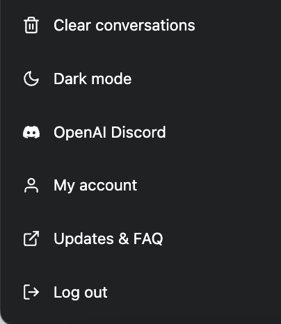

免费版本的ChatGPT经常会遇到超时，系统超载的情况，之前OpenAI好像开通了排队系统，但貌似现在不用排队了。

如果你直接拿国内的信用卡去绑定付款是没办法成功的，搜了一下才知道国内的信用卡都是不支持的，需要国外的信用卡。

## 注册虚拟信用卡(VCC)

人在国内是没有国外信用卡的，后来又了解到可以用虚拟信用卡VCC(Virtual Credit Card)，通过一个中间商开通一个虚拟信用卡，进行国外各种虚拟消费，比如Google Play, Amazon, ChatGPT这种。

网上找了一家

- https://nobepay.com/

也没有做多余的对比，直接就注册了，可以支持微信绑定，支付宝充值，当然也不知道什么时候会跑路。

最低充值¥500，充值好了就可以生成虚拟信用卡了，这里我看到网上说的选择了

- 556766

- 地址在线生成一个，我选的是 Oregon https://www.meiguodizhi.com/

- Oregon（俄勒冈州），Alaska（阿拉斯加州），Delaware（特拉华州），Montana（蒙大拿州）和NewHampshire（新罕布什尔州）这几个地区的地址，不然存在税费

之前第一次地址用的系统自动生成的，无法绑定OpenAI付款信息，后来换了一个Oreon地址，成功能绑定OpenAI。

## 开通ChatGPT Plus

拿到这个虚拟信用卡，我也用它试了一下DeepL, 还是无法绑定，这方面信息接触少，也不知道这些系统是如何判定信用卡和地址的合法性。

OpenAI和ChatGPT的付款信息绑定是不一样的，我先是绑定了OpenAI的付款信息，然后才在ChatGPT左侧菜单中看到了"ChatGPT Plus Upgrade"，点击重新输入虚拟信用卡信息，然后成功绑定了，按月Subscribe

- $20/month

开通之后，多了一个"My Account",  可以显示ChatGPT Plus信息。

## Reference

- https://usvcc.medium.com/

- https://1991421.cn/2023/02/11/479b095c/

- https://www.meiguodizhi.com/

- https://www.xiaoz.me/archives/18336