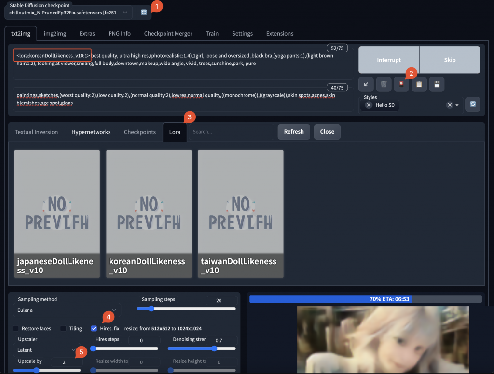

Try the Stable Diffusion, and ChilloutMix, and LoRA to generate the images on Apple M1.

## Guidelines

I follow this guideline to setup the Stable Diffusion running on my Apple M1.

- https://medium.com/@croath/%E4%BD%8E%E6%88%90%E6%9C%AC%E4%BD%93%E9%AA%8C%E7%94%9F%E6%88%90-ai-%E5%B0%8F%E5%A7%90%E5%A7%90%E7%85%A7%E7%89%87-85ffa7c13cd7

- https://github.com/AUTOMATIC1111/stable-diffusion-webui/discussions/5461

## Install stable-diffusion-webui

```
`brew install cmake protobuf rust python@3.10 git wget
git clone https://github.com/AUTOMATIC1111/stable-diffusion-webui`
```

## Download Models

And download the ChilloutMix

- [https://civitai.com/models/6424/chilloutmix](https://civitai.com/models/6424/chilloutmix)

LoRA（Low-Rank Adaptation of Large Language Models）

- https://civitai.com/models/7448/korean-doll-likeness

- https://civitai.com/models/7716/taiwan-doll-likeness

- https://civitai.com/models/10135/japanese-doll-likeness

Places the models to the right directory


## Run the Stable Diffusion WebUI

```
`~/workspace/stable-diffusion-webui/ [master*] ./webui.sh --share --skip-torch-cuda-test --no-half`
```

If doesn't work also need check the `webui-user.sh`, add the COMMANDLINE_ARGS.

```
`vim webui-user.sh
export COMMANDLINE_ARGS="--reinstall-torch --skip-version-check --skip-torch-cuda-test --use-cpu all --share --no-half"`
```

Open in the Browser

- http://127.0.0.1:7860/



## Reference

- https://github.com/AUTOMATIC1111/stable-diffusion-webui/wiki/Installation-on-Apple-Silicon

- https://github.com/AUTOMATIC1111/stable-diffusion-webui

- https://medium.com/@croath/%E4%BD%8E%E6%88%90%E6%9C%AC%E4%BD%93%E9%AA%8C%E7%94%9F%E6%88%90-ai-%E5%B0%8F%E5%A7%90%E5%A7%90%E7%85%A7%E7%89%87-85ffa7c13cd7

- https://github.com/AUTOMATIC1111/stable-diffusion-webui/discussions/5461

- https://github.com/AUTOMATIC1111/stable-diffusion-webui/issues/1890

## Issues

--share

```
`Traceback (most recent call last):
  File "/workspace/stable-diffusion-webui/launch.py", line 361, in 
    start()
  File "/workspace/stable-diffusion-webui/launch.py", line 356, in start
    webui.webui()
  File "workspace/stable-diffusion-webui/webui.py", line 218, in webui
    app, local_url, share_url = shared.demo.launch(
  File "workspace/stable-diffusion-webui/venv/lib/python3.9/site-packages/gradio/blocks.py", line 1418, in launch
    raise ValueError(
ValueError: When localhost is not accessible, a shareable link must be created. Please set share=True.`
```

--no-half

```
`Applying cross attention optimization (InvokeAI).
Textual inversion embeddings loaded(0):
Model loaded in 2.3s (create model: 0.6s, apply weights to model: 0.5s, apply half(): 0.5s, move model to device: 0.4s).
Running on local URL:  http://127.0.0.1:7860
  0%|                                                                                        | 0/20 [00:00' and 'tensor' are not broadcast compatible
LLVM ERROR: Failed to infer result type(s).
[1]    24944 abort      ./webui.sh --share --skip-torch-cuda-test
/opt/homebrew/Cellar/python@3.9/3.9.13_1/Frameworks/Python.framework/Versions/3.9/lib/python3.9/multiprocessing/resource_tracker.py:216: UserWarning: resource_tracker: There appear to be 1 leaked semaphore objects to clean up at shutdown
  warnings.warn('resource_tracker: There appear to be %d '`
```

--enable-insecure-extension-access

```
`workspace/stable-diffusion-webui/modules/ui_extensions.py", line 22, in check_access
    assert not shared.cmd_opts.disable_extension_access, "extension access disabled because of command line flags"
AssertionError: extension access disabled because of command line flags`
```

```
`    proc.wait(**kwargs)
  File "~/workspace/stable-diffusion-webui/venv/lib/python3.9/site-packages/git/cmd.py", line 502, in wait
    raise GitCommandError(remove_password_if_present(self.args), status, errstr)
git.exc.GitCommandError: Cmd('git') failed due to: exit code(128)
  cmdline: git clone -v  https://github.com/civitai/sd_civitai_extension  /workspace/stable-diffusion-webui/tmp/sd_civitai_extension
  stderr: 'Cloning into '~/workspace/stable-diffusion-webui/tmp/sd_civitai_extension '...
fatal: protocol ' https' is not supported`
```

All the params

```
`usage: launch.py [-h] [--data-dir DATA_DIR] [--config CONFIG] [--ckpt CKPT] [--ckpt-dir CKPT_DIR] [--vae-dir VAE_DIR] [--gfpgan-dir GFPGAN_DIR]
                 [--gfpgan-model GFPGAN_MODEL] [--no-half] [--no-half-vae] [--no-progressbar-hiding] [--max-batch-count MAX_BATCH_COUNT]
                 [--embeddings-dir EMBEDDINGS_DIR] [--textual-inversion-templates-dir TEXTUAL_INVERSION_TEMPLATES_DIR] [--hypernetwork-dir HYPERNETWORK_DIR]
                 [--localizations-dir LOCALIZATIONS_DIR] [--allow-code] [--medvram] [--lowvram] [--lowram] [--always-batch-cond-uncond] [--unload-gfpgan]
                 [--precision {full,autocast}] [--upcast-sampling] [--share] [--ngrok NGROK] [--ngrok-region NGROK_REGION]
                 [--enable-insecure-extension-access] [--codeformer-models-path CODEFORMER_MODELS_PATH] [--gfpgan-models-path GFPGAN_MODELS_PATH]
                 [--esrgan-models-path ESRGAN_MODELS_PATH] [--bsrgan-models-path BSRGAN_MODELS_PATH] [--realesrgan-models-path REALESRGAN_MODELS_PATH]
                 [--clip-models-path CLIP_MODELS_PATH] [--xformers] [--force-enable-xformers] [--xformers-flash-attention] [--deepdanbooru]
                 [--opt-split-attention] [--opt-sub-quad-attention] [--sub-quad-q-chunk-size SUB_QUAD_Q_CHUNK_SIZE]
                 [--sub-quad-kv-chunk-size SUB_QUAD_KV_CHUNK_SIZE] [--sub-quad-chunk-threshold SUB_QUAD_CHUNK_THRESHOLD] [--opt-split-attention-invokeai]
                 [--opt-split-attention-v1] [--disable-opt-split-attention] [--disable-nan-check] [--use-cpu USE_CPU [USE_CPU ...]] [--listen] [--port PORT]
                 [--show-negative-prompt] [--ui-config-file UI_CONFIG_FILE] [--hide-ui-dir-config] [--freeze-settings] [--ui-settings-file UI_SETTINGS_FILE]
                 [--gradio-debug] [--gradio-auth GRADIO_AUTH] [--gradio-auth-path GRADIO_AUTH_PATH] [--gradio-img2img-tool GRADIO_IMG2IMG_TOOL]
                 [--gradio-inpaint-tool GRADIO_INPAINT_TOOL] [--opt-channelslast] [--styles-file STYLES_FILE] [--autolaunch] [--theme THEME]
                 [--use-textbox-seed] [--disable-console-progressbars] [--enable-console-prompts] [--vae-path VAE_PATH] [--disable-safe-unpickle] [--api]
                 [--api-auth API_AUTH] [--api-log] [--nowebui] [--ui-debug-mode] [--device-id DEVICE_ID] [--administrator]
                 [--cors-allow-origins CORS_ALLOW_ORIGINS] [--cors-allow-origins-regex CORS_ALLOW_ORIGINS_REGEX] [--tls-keyfile TLS_KEYFILE]
                 [--tls-certfile TLS_CERTFILE] [--server-name SERVER_NAME] [--gradio-queue] [--skip-version-check] [--no-hashing] [--no-download-sd-model]
                 [--ldsr-models-path LDSR_MODELS_PATH] [--lora-dir LORA_DIR] [--scunet-models-path SCUNET_MODELS_PATH]
                 [--swinir-models-path SWINIR_MODELS_PATH]`
```