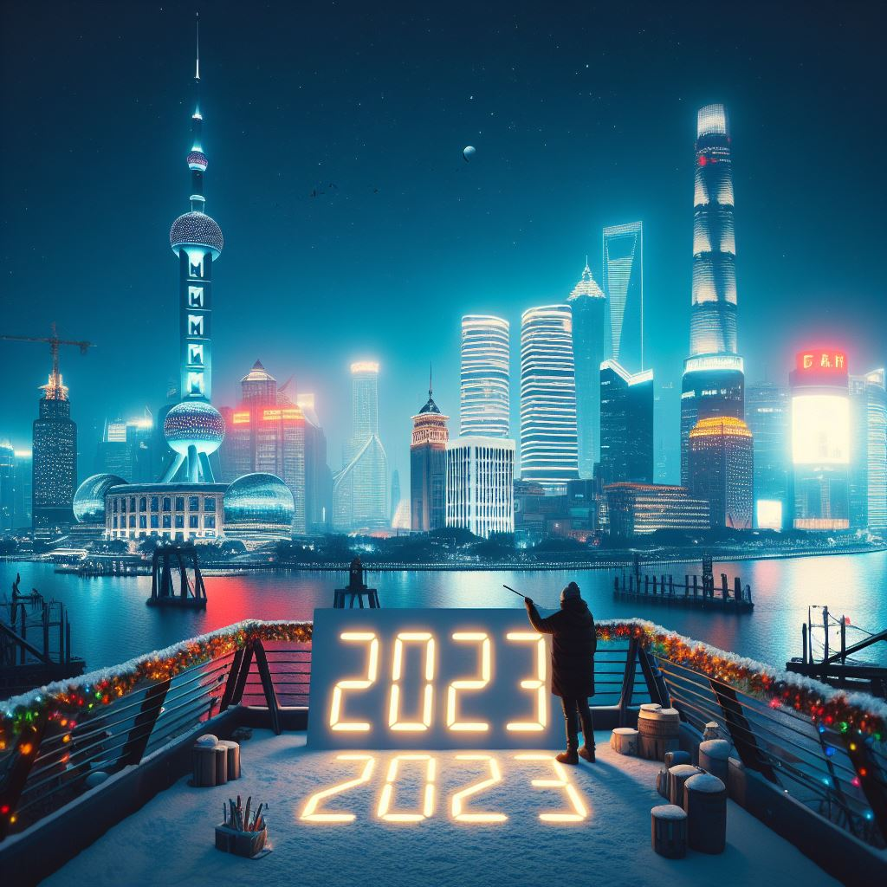

[09总结](https://pjq.me/?p=833)|[2](https://pjq.me/?p=833)[010年终总结](https://pjq.me/?p=898)|[2011年终总结](https://pjq.me/?p=993)|[2012年终总结](https://pjq.me/?p=1126)|[2013年终总结](https://pjq.me/?p=1249)|[2014年终总结|](https://pjq.me/?p=1280)[2015年终总结](https://pjq.me/?p=1318)[|](https://pjq.me/?p=1280)[2016年终总结](https://pjq.me/?p=1324)|[2017年终总结](https://pjq.me/?p=1355)|[2018年终总结](https://pjq.me/?p=1435)|[2019年终总结](https://pjq.me/?p=1523)|[再见2020](https://pjq.me/?p=1564)|[2021年终总结](https://pjq.me/?p=1619)|[2022年终总结](https://pjq.me/?p=1826)

时间又一次在不经意间来到了12月31日，今天的上海雾霾笼罩，天气湿冷，温度5-8度。

去年的同期，3年封禁结束，大家都在渡劫，而今年却又在一次次见证历史

## 见证历史

疫情三年，我们见证了历史，而在2023年，我们一次又一次的看到了历史的轮回。

往前看，2023年可能是最好的一年。

我们看到了全球股市暴涨，而中国股市暴跌，人民币汇率暴跌，房价泡沫暴跌，大量公司裁员，大学生毕业即失业，舆论管控越来越让人窒息，新生人口断崖式下跌，外国人90%已经离开并且没有回来，愚民教育从娃娃抓起，韭菜不够用了，口号式治国，一个章毁掉一个行业。而所有的一切看起来都是风平浪静，闭嘴成为每一个人的必修课，禁言成为了风尚，有问题不是解决问题，而是解决提出问题的人。

也许，明年我们能看到更多的历史。

## AI元年

OpenAI ChatGPT的横空出世，让我们有幸看到了AI的跳跃式发展，GPT3, GPT3.5, GPT-4, GPT-Vision, Stable Diffusion, Midjourney, Llama, Bard, Mixtral, 每天一睁眼就能见到很多新奇的东西，这种感觉从末有过，在一年的时间里，各事新技术层出不穷，让我们在这片草台班在控制的混沌世界中，看到了科技的美好，就像有股清流，缓缓流过。

这一年，一直在跟踪AI的进展，这是一种从未有过的体验，第一次开始担心，程序员要真的失业了。但在失业之前，跟上AI的进化，努力做到与时俱进，用AI来作为日常工具，帮忙解决一些工作问题。

第一次在AI的帮助下，零基础，用Flutter写了一个客户端，发布到Google Play/Apple Store。虽然只有一个很少的偿试，但却看到了AI的无限可能。

- [https://chitchat.pjq.me/](https://chitchat.pjq.me/)

越来越感觉AGI会在不久的将来到，可能我们正在经历一段最好的时代。

在AI的帮助下，某些事情的工作效率可以成倍提升，基本上已经让AI作为日常辅助工具，有问题先问GPT-4，已经慢慢成为了一种习惯，明年应该能看到GPT-4.5甚至GPT-5的出现。

当打不过AI的时候，努力拥抱它，是当下我们能做的。

当然我先希望科技向善，未来人类不会被AI玩死，但谁知道呢？

## 顶峰

2013年-2016年，可能有幸经历了在现在看来不可思议的一段工作。

当时在EF上海，当时一起工作的同事有来自全世界各个地方的，也是在那里感受到了不同的文化交融，那时候外国人很多人来到上海工作。

感觉可以去写一篇回忆录了，当时Mobile组内就有各个国家的人，有英国人，法国人，澳大利亚人，瑞典人，韩国人，墨西哥人，突尼斯人，波兰人，台湾人，意大利人，希腊人，俨然就是一个小小的联合国，他们中有的是一个人，有的是拖家带口的，他们来到上海并喜欢在上海的生活，也喜欢吃各种中国菜，当时静安寺一带，到南京西路，大大小小的餐馆都吃了个遍，大家在一起都相处的很好，有些人也在上海讨了老婆，那个时候感觉外国人都喜欢来上海，也喜欢中国，他们除了呆在上海，也会到全国各地游玩，记得当时就带了几个同时一起去[爬了黄山](https://pjq.me/?p=1289)，当时还了一遍游记。

- https://pjq.me/?p=1289

虽然现在也是外企，但和当时的感觉完全不一样，那时候不用写邮件，都是面对面沟通，经常一起吃饭，KTV，一起玩。

只有交流才能打破文化障碍，固步自封，拒人千里，终成文明洼地。

当时公司50周年庆，Offsite是在柬埔寨，吴哥窟，拍了50周年庆的视频，Youtube上找到官方视频，聊作记念，这个视频还申请了吉尼斯世界纪录，最多国家民族人在唱一首歌，这样的世界可能再也回不去了。

https://www.youtube.com/watch?v=q0Jo9Reahvs

## 未来

回顾过去，珍惜当下，展望未来，只是未来还有吗？

还有明年，要努力学好Cryptography。