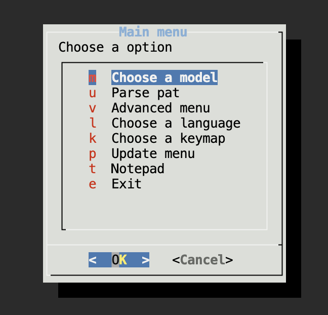
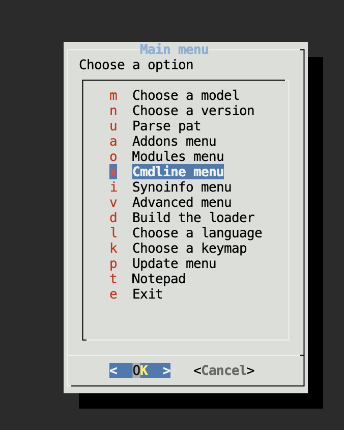
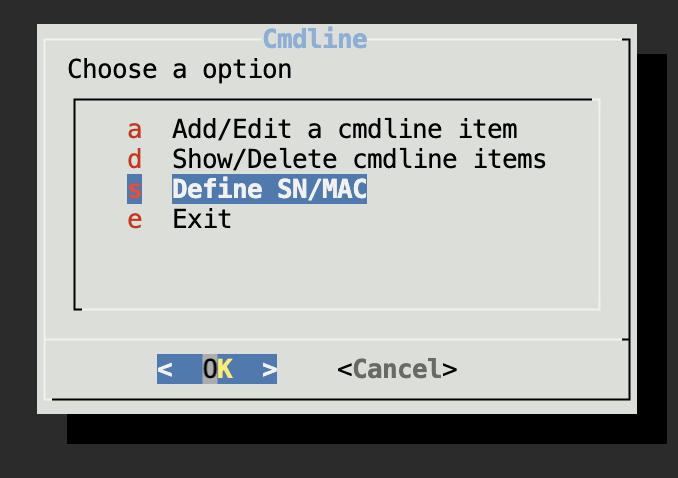
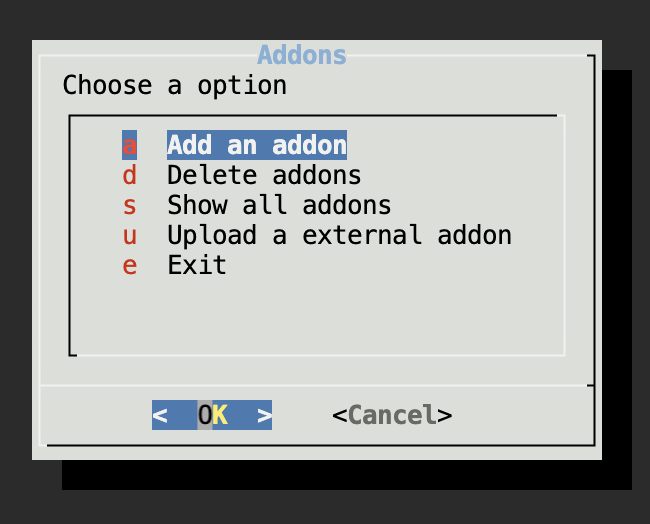
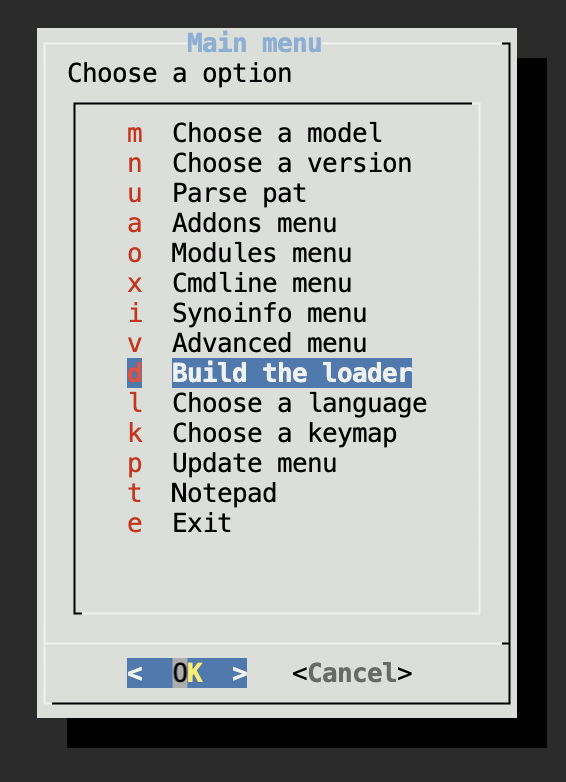
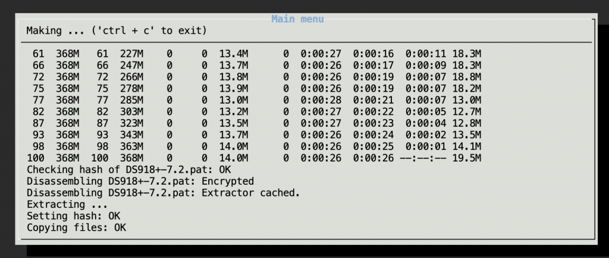
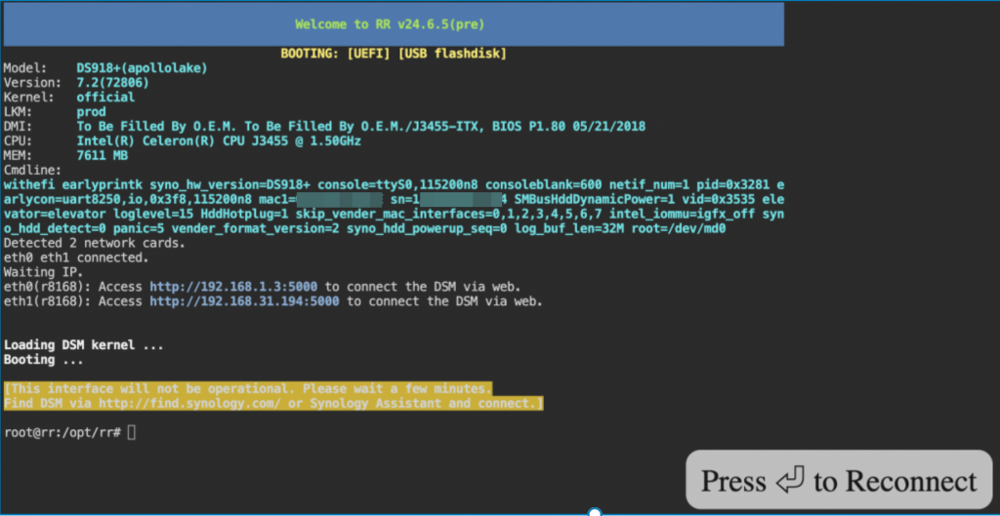
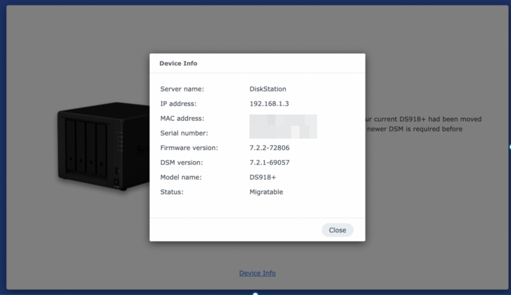

## Refer the document

- https://divineengine.net/article/installing-synology-dsm-7-with-automated-redpill-loader/

## Download arpl-i18n

- https://github.com/RROrg/rr/releases

## Download balenaEtcher used to flash the rr.img on the USB disk

- https://etcher.balena.io/#download-etcher


## Build the loader

Then boot the USB disk, and open in browser

- http://192.168.1.3:7681/

We can do

- Set the command line with SN/MAC

- Compile the bootloader

- Then start with bootloader

It may take up to 5 mins to get the server back, we can use ping to monitor it live or not

```
`ping 192.168.1.3
ping 192.168.31.194`
```




Choose version


[Optional]Commandline menu-> define SN/MAC





Add Addons




Build the loader





After the build progress finished it will back to the main menu, then boot the loader.


## Install the DSM



When the server go alive, open the link, the follow the guide to Install DiskStation Manager step by step

- http://192.168.1.3:5000/web_index.html





Here we can use the pat file download during the bootloader compiling.

- [https://global.synologydownload.com/download/DSM/release/7.2.2/72806/DSM_DS918%2B_72806.pat](https://global.synologydownload.com/download/DSM/release/7.2.2/72806/DSM_DS918%2B_72806.pat)

## Troubleshooting

- Can't find the server and ping ip, refer to the solutions 

- https://rrorg.cn/archives/issues

- https://mi-d.cn/7303

- [https://www.mi-d.cn/8116](https://www.mi-d.cn/8116)

- https://github.com/RROrg/rr/issues/1894

- https://github.com/RROrg/rr/issues/175

- Solutions I tried for J3455

- 1. Disable serial port in Bios

- 2. Kernel switch: Power -> kexec

- 3. 直接启动

- 

- File is broken

- https://github.com/RROrg/rr/issues/1294