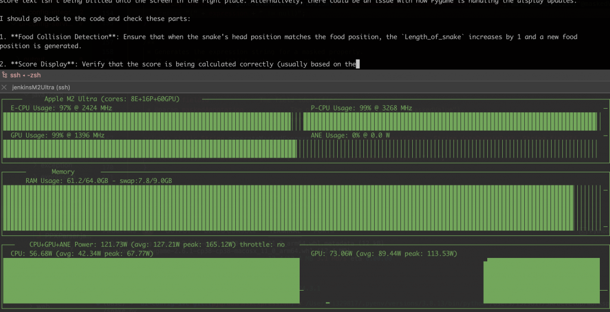

The DeepSeek just released the DeepSeek R1, and it's Open Source, so let's running it locally with ollama

First, I got one Mac Pro

## Setup Environment

Install the monitor tools

- asitop show the Mem/GPU/CPU usage and power

- htop show the Mem/CPU usage

```
`brew install pipx
pipx install asitop
brew install htop`
```

## Install ollama

```
`brew install ollama`
```

## Run DeepSeek R1

```
`ollama serve&
ollama run deepseek-r1:70b`
```

More DeepSeek R1 models

- [https://ollama.com/library/deepseek-r1](https://ollama.com/library/deepseek-r1)


The CPU Power around 80W



## ollama API

```
``
```

ollama will start one local server

- http://localhost:11434

So we can integrate it with some 3rd party Apps that support ollama, here is the App list that support ollama, and the API is compatible with OpenAI API, so we can use any App to do the integration that support Open AI API.

- https://github.com/ollama/ollama?tab=readme-ov-file#web--desktop

## LobeChat with ollama

Refer the document

- https://lobehub.com/docs/usage/providers/ollama

On Mac, need set the environment, the restart the ollama(This is for desktop Application)

```
`launchctl setenv OLLAMA_ORIGINS "*"`
```

If need to start with the command line

```
`OLLAMA_ORIGINS="*" ollama serve`
```

If need to build support bind to 0.0.0.0, so other machine can access the API by the ip address.

```
`OLLAMA_HOST=0.0.0.0 ollama serve &`
```

so one line command for quick start

```
` OLLAMA_HOST=0.0.0.0 OLLAMA_ORIGINS="*" ollama serve`
```

