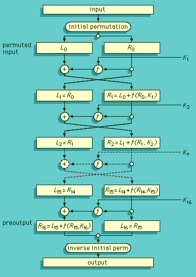
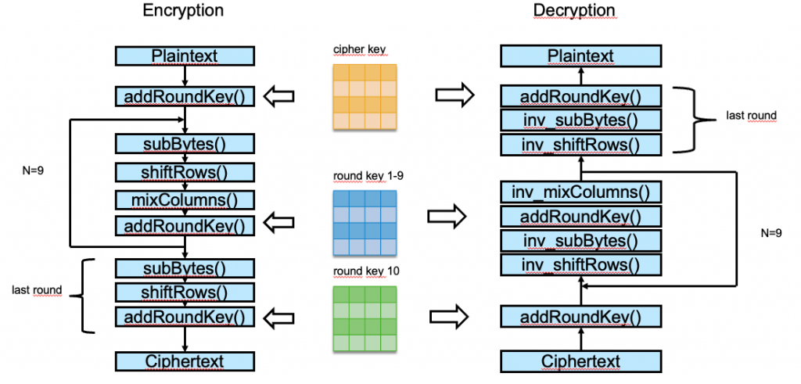
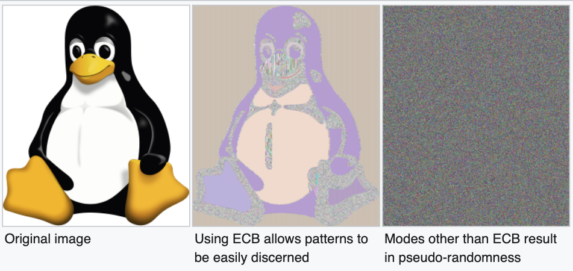
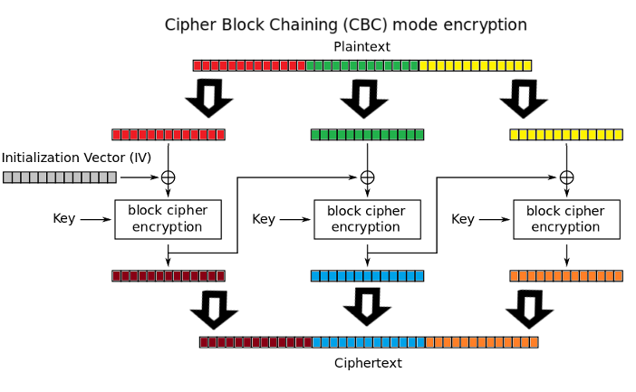
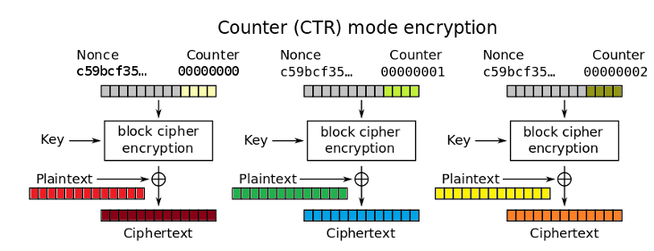
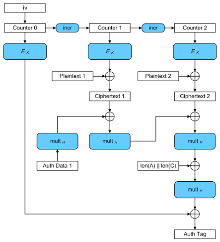

之前一篇文章讲过古典密码学。

这篇文章我们来聊一下对称加密(Symmetric Encryption)。

这个名字其实有点唬人，简单说就是只需要一把钥匙可以用来把文件加密，然后解密也是同一把钥匙。

比如说我们要对PDF进行加密，那就会有需要同一个密码进行打开，如果没有这个密码，你就看不了里面的内容。

文件加密之后我们就可以把文件存在一些公开的网盘里面，或者分享给其他人，然后别人通过密码就可以看了，如果没有密码，就算别人得到文件也无法知晓里面的内容。

## Blocker Cipher(分组加密)

一个文件可能很大，所以密码学上一般会把内容进行固定长度的切割，然后一块内容一块内容进行加密，这个就是分组加密，与之对应的就是流加密(Steam Cipher)。

## DES(Data Encryption Standard)

DES(Data Encryption Standard), 它1977年成为标准。这个名字看起来很高级，其实现在已经不用了，甚至说禁止使用，因为随着计算机算力的不断发展，它56位的密码长度很容易就被爆破出来(Brute Force)，1999年就被爆破了，但在一段时间之内，它就是标准的密码加密算法。

- https://en.wikipedia.org/wiki/Data_Encryption_Standard

它的流程如下图，基于Feistel Network结构，16轮运算，Block Size 64位，分为左右各32位，然后进行16轮运算，每轮运算就都使用不同的密码(KDF,随称密钥派生, Key Derivation Function)，最后输出同等长度的64位密文。



后面还有3DES， 就是进过三轮DES加密，因为密码长度始终只有56位，所以也被淘汰了。

这样就不得不寻求新的加密方式

## AES(Advanced Encryption Standard)

随着DES的安全性越来越弱，美国NIST在1997年发起了新的加密算法的竞算，经过多轮挑战，最终Rijndael算法被选自AES标准。

- https://en.wikipedia.org/wiki/Advanced_Encryption_Standard_process


所以在2001年，Rijndael被当做标准，成为AES算法，这里有当年AES成为标准的提案。

- [https://csrc.nist.gov/csrc/media/projects/cryptographic-standards-and-guidelines/documents/aes-development/rijndael-ammended.pdf#page=3](https://csrc.nist.gov/csrc/media/projects/cryptographic-standards-and-guidelines/documents/aes-development/rijndael-ammended.pdf#page=3)

最终选取

- Block size: 128位

- Key size: 128, 192, 256位

- 结构网络：SPN(Substitution Permutation Network)

- 10/12/14轮运算(分别对应的密码长度128, 192, 256位)

大致过程如下图，主要步骤有

- 密码扩展(Key Expansion)，分别生成10轮密钥

- 初始过程(直接明文 XOR Key)

- 然后9轮迭代

- 字节替换([S-Box](https://en.wikipedia.org/wiki/Rijndael_S-box)替换)

- 行位移(Left Shift)

- 列混淆(很复杂！！！)

- 轮密码加(XOR Key n)

- 最后一轮

- 字节替换

- 行位移

- 轮密码加



整个过程，说简单也简单，说负杂也负杂，反正经常一通各种转换，生成加密之后的结果：密文。

这就是简单的AES 加密的整个过程了。

## AES - ECB

之前说过AES是Block Cipher也就是块加密，它需要把内容分成块加密，所以我们最容易想到的就是，切块之后，每个块单独进行加密，这个方式呢就是ECB模式。

如下图所示


但是它有个致命的缺点，就是相同的明文，加密之后的密文是一样的。

这里我们就要祭出下面这张图片了，左边是原图，中间是经常AES加密之后的结果。很明显虽然加密了，但我们还是可以看到图片的大概内容。



所以实际上，这种方式是不能使用了。

## AES - CBC

看了之前的ECB模式，发现问题，所以这里我们希望引入一些随机性(IV), 这样加密出来的结果就不会像ECB模式那样了。

如下图就是CBC模式，引入初始向量，然后每次的密文都做为下一个加密的IV，这样就可以产生更多的随机性。



当然它也有个问题，不能并行运算，只能串行，如果需要很快的加密，那这种方式显示就不合理了。

## AEC - CTR

CTR计数器模式，这个模式有点像流加密(Stream Cipher), 引入一个随机数(Nonce), 然后就引入个计数器 0000, 0001, 0002, 000N

CTR模式加密是这个随机数+Counter, 然后再和明文进行 XOR。所以它解决了上面CBC模式不能并行运算的问题，然后也足够随机。



但这里也有一个问题，就是一定要确保随机数是真的随机，不要复用，每次都生成新的随机数。

M1, M2是两个明文，C1, C2是通过CTR模式加密的密文，黑客可以拦截C1, C2，  然后想办法推导出明文

```
`C1=M1 XOR K
C2=M2 XOR K
C1 XOR C2 = M1 XOR K XOR M2 XOR K = M1 XOR M2`
```

如果我们知道M1，那就很容易推导出M2， 就算不知道M1，也能通过某些规律推荐出明文。

所以CTR模式一定要确保随机数的唯一性，绝对不要重复。

还有CTR模式不需要padding, 因为它最终的操作是 XOR, 不用对明文进行补全。

## AES - GCM

GCM模式应该是当前最推荐的模式，它即有CTR模式的随机性(Nonce + Counter), 又叠加了认证信息，防篡改，也就是

- Ÿ1. 保密性 Confidentiality

- Ÿ2. 完整性 Integrity

看下面这个图，它引入更复杂的运算方式，把明文密文各个部分都进行了连接，算出了一个Auth Tag, 这样就要内容被篡改，就能立刻知道，直接丢弃。



所以现在AES最推荐方式是GCM模式，当然它能提高安全保密级别，意味着也需要消耗更多的算力，需要更长时间的运行，所以这个就取决于我们需要哪个级别的加密方式。当前GCM也是业力最推荐的方式，比如TLS1.3里面

- https://owasp.org/www-chapter-london/assets/slides/OWASPLondon20180125_TLSv1.3_Andy_Brodie.pdf

在TLS1.3里面GCM, CCM都是推荐的方式


## MAC与HMAC

虽然我们有了AES加密，但为了确保加密信息没有不篡改过，就有引入消息认证码MAC, 它通过私钥对明文消息进行hash运算

MAC=Hash(KⅡM)

但由于hash运算每一步都是确定的，所以给了黑客在不知道私钥的情况下，对原消息和MAC进行篡改而不被服务器发现，这个攻击叫Length Extension Attack.  像以前经常会对API参数用私钥加上一个签名生成一个MAC，但实际这种方式给了给个攻击的机会，所以这个漏洞发现之后就禁止使用简单的单次hash 生成的MAC，而改为HMAC，它的计算过程设计了更多的随机组合加上两次hash 运算，直接堵死了由于单次hash运算带来的状态确定性。

所以用HMAC就是我们验证消息完整性和认证性的解决方案了。

对称加密简单的介绍就到这里了。