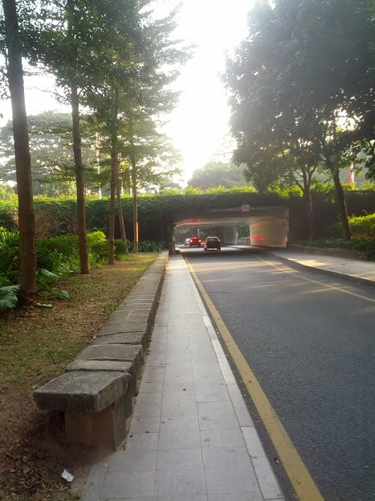

**深圳印象之一 **

在2013年底,我又去了一次深圳,这是我第二次来到深圳了.

有人说深圳是一座充分竞争的城市, 这句话一点都不假, 这座南方城市的精髓就是完全融入了自由的市场竞争.
改革开放之后迅速发展起来的城市, 随波逐流之中被推到了时代的前沿.
“北上广深”, 已经完全跻身于大都市前列的深圳, 更为大家所熟知的是她的山寨精神, 说她已经席卷全球也不为过.

对于深圳的印象并不是太好, 2012年国庆我第一次来到了深圳.当时的感觉深圳是有点”乱”的.
发达的地面交通系统, 宽阔的马路, 马路两旁的绿化很好, 各种亚热带才有的植物, 树木, 都生长的很茂盛.随处可见的和我一样的外来务工人员, 各种夸张发型的小年青. 马路上数不尽的电动车, 有时也对红绿灯视若无物. 更有地铁口, 一排看过去, 热情回眸招手示意的热情大叔. 还有就是不胜枚举的各类电子厂, 只要你能想到的电子设备, 都能在深圳找到. 当然不能忽视享誉全国的华强北, 山寨手机的最核心的交易场所. 只是当时, 山寨手机已经略显萧条, 华强北的手机交易场所已经凋零了很多, 地面上各种传单, 空空的店面, 让人不胜嘘嘘, 很难想起这曾是风靡全球的山寨手机之都.

说到深圳, 我想大家耳熟能详的当属腾讯和华为了.

这两家公司取的成绩不得不令很多大佬级公司侧目了. 充分的竞争, 激烈的市场环境, 毅然屹立于深圳, 走向全国, 走向世界. 确实值的每一个人的尊敬. 他们是大公司, 但确不是伟大的公司, 这是我一贯的评价. 套用时下最时髦的话, 那就是”人艰不拆, 细思恐极”. 残酷的竞争环境, 必然需要建立在牺牲某些核心人性的东西. “一将功成万古枯”, 自古皆然. 只是希望有朝一日能够看到更多关注人性的公司, 而不是一味的强调所谓的狼性. 但活在天朝, 容不得你有哪怕一分的幻想. 活着已是不易, 何妄奢求于自由的世界.

在这里加班应该是普遍现象了, 而不单单是作为码农才有的殊荣. 劳动密集型的作业, 需要大量的操作工, 大量的人力和时间的堆砌才能换得那一丁点的利润. 多少人满怀梦想来到深圳, 为闯出一片天地, 活出自己应有的尊严而努力奋斗. 他们才是最值得尊敬的人.

