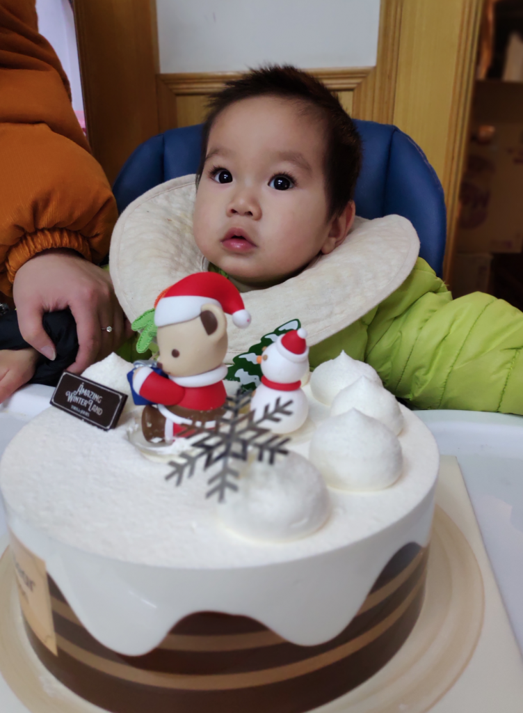

[2009总结](http://pjq.me/?p=833)|[2](http://pjq.me/?p=833)[010年终总结](http://pjq.me/?p=898)|[2011年终总结](http://pjq.me/?p=993)|[2012年终总结](http://pjq.me/?p=1126)|[2013年终总结](http://pjq.me/?p=1249)|[2014年终总结|](http://pjq.me/?p=1280)[2015年终总结](http://pjq.me/?p=1318)[|](http://pjq.me/?p=1280)[2016年终总结](http://pjq.me/?p=1324)|[2017年终总结](http://pjq.me/?p=1355)|[2018年终总结](https://pjq.me/?p=1435)  

今年刚好是第十个年终总结。

最近几天都在搬家，再加上天气渐凉，白天都在帮着带娃，第一次感觉没有太多时间来写年终总结。

打开电脑已经是晚上11:10了，多少都写点吧，有空再补。

2018年很忙，主要在忙几件事

- 2月份生宝宝了
- 3月份成了房奴，嗯，不是最高点，但也是次高点，感觉整个 人生都在给国家打工。
- 5-8月份的装修，家里的电器能摇控的控制了，所有的灯，电动窗帘，油烟机，空调，晒衣机等等，洗碗机，净水器，洗烘一体洗衣机，垃圾处理器，智能马桶都用上了，嗯，感觉很高科技的样子。
- 11月开始上海居转户，知道的人都清楚，万里长征第一步，经历过，其它事情相比就什么都不算事了。
- 12月底搬家，最近几年连续搬了好多次家，也就慢慢习惯了。
- 移动开发已经走到一个转折点了，所以感觉要失业了，或者说即将要失业了。
- 最近可能是人工智能元年，新一代的人工智能技术将慢慢渗透到各行各业。

从2008年到2018年，经历了整个移动互联网的发展历程。比如早期的慢慢摸索，刀跟火种，到后来的群雄逐鹿，天下大治，真的是应了古人说的话，“天下大事，分久必合，合久必分”。当经历过一个时代，你再去看历一个时代的时候，你能找到很多相同的地方，一个轮回，又一个轮回，花开，花落，随着时间的车轮滚滚向前。

从现实世界，到虚拟网络，其实我一直只是觉得换了一种方式，所有的关系也只是从一种状态转移到了另一种状态。

择其一点，攻破之，必能成事。只是风口过后猪却未必能再飞起来。这两年的各种公司倒闭潮，各种裁员，人人居安司危，然而唯一不变的还是变，持续学习，提高自己，就是最好的。

时间还是最宝贵的，利用有限的时间达到最大的收益率，将会是很重要的一个能力。

2019年加油，好好工作，好好跑步，好好照顾家人，愿宝宝健康快乐成长。

