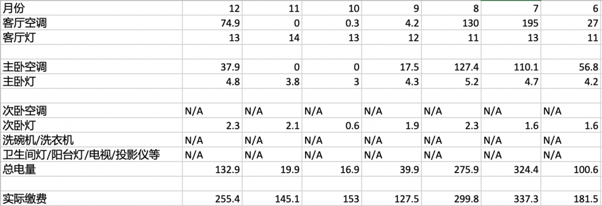

最近看到很多人在抱怨电费多，查了下12月的电费感觉确实比平时多一些，但也没有多的离谱。

家里的很多设备都是连的智能开关，和智能插座，所以手机上可以看到最近几个月的用电量，虽然不知道是不是准确，但可以用来做一个横向对比，尤其今年夏天特别热，7，8月份用电也比较多。

当然有些设备没有连智能插座，比如洗碗机，电视，投影仪，一个空调，所以查到的数据也只是其中一部分用电量。9月/10月/11月，没有开空调，用电量比较少一些，但也在140元左右，而这部分电量应该就是那些统计不到电量的设备耗电量，我们把这些看做基础耗电。

每个月的基础耗电也会上下波动, 我们根据下面公式，以0.6-0.7元/度电

- (实际缴费-基础耗电)/总电量=0.6～0.7元度

大概倒推出每个月的基础耗电，12月达到170，高于其它月份，虽然算不上特别离谱，但也还算是可以接受的范围。

接下去我查了2021.12电费242.8，和今年同期的255.4基本相差不大。

所以总的来看2022.12电费在正常范围之类。