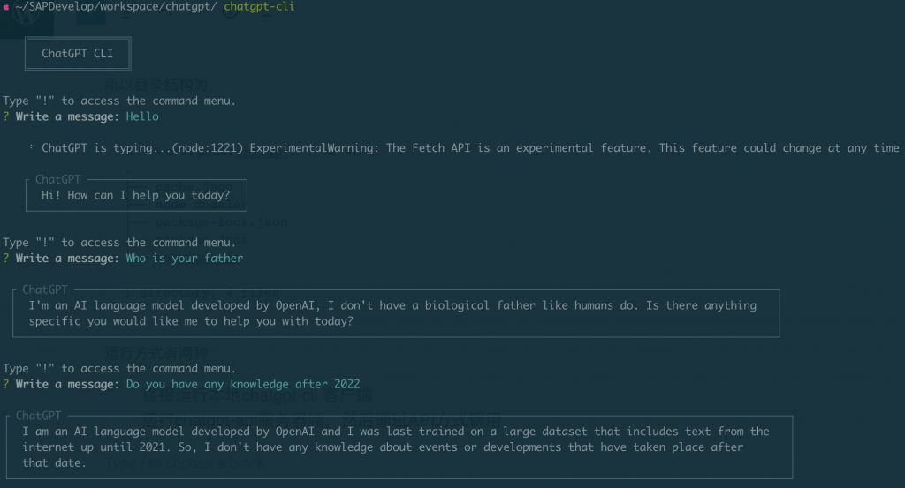

ChatGPT因为一直在调用远端API，经常会出现超时或者挂掉的情况，本地跑一个ChatGPT是一个不错的选择(这里有误解，其实还是调用远端的`text-chat-davinci-002-20230126`，只是不用付钱)。

在Twitter Timeline上看到这个repo, 据说是第一个发现官方模型泄露的

- [https://github.com/waylaidwanderer/node-chatgpt-api](https://github.com/waylaidwanderer/node-chatgpt-api)

> 

This is an implementation of [ChatGPT](https://chat.openai.com/chat) using the official ChatGPT raw model, `text-chat-davinci-002`. This model name `text-chat-davinci-002-20230126` was briefly leaked while I was inspecting the network requests made by the official ChatGPT website, and I discovered that it works with the [OpenAI API](https://beta.openai.com/docs/api-reference/completions). **Usage of this model currently does not cost any credits.**

As far as I'm aware, I was the first one who discovered this, and usage of the model has since been implemented in libraries like [acheong08/ChatGPT](https://github.com/acheong08/ChatGPT).

The previous version of this library that used [transitive-bullshit/chatgpt-api](https://github.com/transitive-bullshit/chatgpt-api) is still available on [the `archive/old-version` branch](https://github.com/waylaidwanderer/node-chatgpt-api/tree/archive/old-version).

By itself, the model does not have any conversational support, so this library uses a cache to store conversations and pass them to the model as context. This allows you to have persistent conversations with ChatGPT in a nearly identical way to the official website.

## How to run

其实运行很简单

```
`brew install node
mkdir chatgpt
cd chatgpt
npm i -g @waylaidwanderer/chatgpt-api
vim settings.js`
```

更新settings.js里面API Key

```
`module.exports = {
  // Your OpenAI API key
  openaiApiKey: process.env.OPENAI_API_KEY || 'YOUR_OPENAI_API_KEY',
  chatGptClient: {
    // (Optional) Parameters as described in https://platform.openai.com/docs/api-reference/completions
    modelOptions: {
      // The model is set to text-chat-davinci-002-20221122 by default, but you can override
      // it and any other parameters here
      model: 'text-chat-davinci-002-20221122',
    },
    // (Optional) Set custom instructions instead of "You are ChatGPT...".
    // promptPrefix: 'You are Bob, a cowboy in Western times...',
    // (Optional) Set a custom name for the user
    // userLabel: 'User',
    // (Optional) Set a custom name for ChatGPT
    // chatGptLabel: 'ChatGPT',
    // (Optional) Set to true to enable `console.debug()` logging
    debug: false,
  },
  // Options for the Keyv cache, see https://www.npmjs.com/package/keyv
  // This is used for storing conversations, and supports additional drivers (conversations are stored in memory by default)
  cacheOptions: {},
  // Options for the API server
  apiOptions: {
    port: process.env.API_PORT || 3000,
    host: process.env.API_HOST || 'localhost',
    // (Optional) Set to true to enable `console.debug()` logging
    debug: false,
  },
  // If set, ChatGPTClient will use `keyv-file` to store conversations to this JSON file instead of in memory.
  // However, `cacheOptions.store` will override this if set
  storageFilePath: process.env.STORAGE_FILE_PATH || './cache.json',
};`
```

所以目录结构为

```
` ~/workspace/chatgpt/ tree -L 1
.
├── cache.json
├── node_modules
├── package-lock.json
├── package.json
└── settings.js

1 directory, 4 files`
```

运行方式有两种

- 直接运行本地chatgpt-cli 客户端

- 运行chatgpt-api服务器端，然后通过API方式调用

## chatgpt-cli

运行cli客户端比较方便，可以直接进行交互，并且有本地session缓存

```
` chatgpt-cli`
```



## chatgpt-api

```
`chatgpt-api`
```

运行服务器端，通过API POST方式调用

```
`curl -H "Content-Type: application/json" -X POST -d '{"message": "Hello, Who build you and who are you?", "conversationId": "your-conversation-id (optional)", "parentMessageId": "your-parent-message-id (optional)"}' http://localhost:3000/conversation`
```

```
`{
    "message": "Hello, how are you today?",
    "conversationId": "your-conversation-id (optional)",
    "parentMessageId": "your-parent-message-id (optional)"
}`
```

```
`{"response":"Hello! I was built by OpenAI, an artificial intelligence research laboratory consisting of the for-profit technology company OpenAI LP and its parent company, the non-profit OpenAI Inc. I am an AI language model based on the transformer architecture, trained on a diverse range of text data from the internet. My goal is to generate human-like text responses to prompts given to me by users.","conversationId":"your-conversation-id (optional)","messageId":"135c66ed-2ae1-4672-96aa-99fce77826a5"}`
```