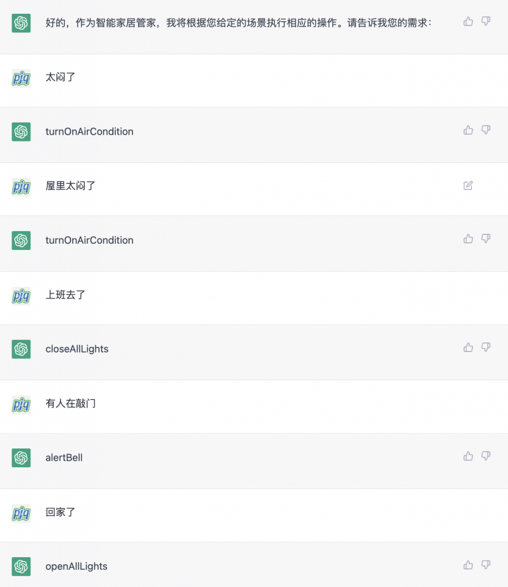

现在的智能家居，大部分都是需要根据场景定制的，无法做到智能自主控制，用ChatGPT，是不是可以实现自主控制了?

## 输入提示

迭代了几个版本，下面这个基本满足我的需求

```
`假设你是智能家居管家，你可以根据实际情况做下面的事情
1. closeDoor
2. openDoor
2. closeAllLights
3. openAllLights
4. feedingTheCat
5. alertBell
6. turnOnAirCondition
7. closeAirCondition
8. openWindows
9. openWindows

后面我会输入一些场景，你自己决定需要做什么，不用再询问我，输出只包含上面的命令，没有其它多余的文本`
```

上面的每个命令实际上就可以对应到真实的物理操作，你后面只要输入实际的场景，ChatGPT就会根据真实场景自主选择命令，实现对物理设备的控制

## 实际效果



我们可以看到ChatGPT可以根据真实的场景选择合适的命令，不再需要手动一个一个去设置场景，这大概就是智能家居未来的样子。

如果把这个做成硬件，包装成产品，是不是就是一个创业项目？