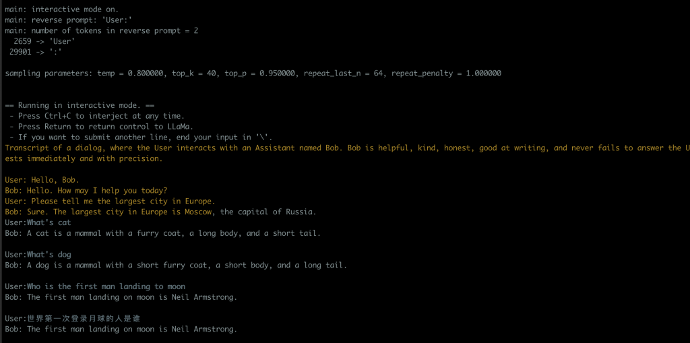

昨天GPT-4发布，除了惊艳还是惊艳，OpenAI的进化速度超乎想象。

除此之外，最近我也在关注LLaMa((Large Language Model Meta AI) 

- [https://ai.facebook.com/blog/large-language-model-llama-meta-ai/](https://ai.facebook.com/blog/large-language-model-llama-meta-ai/)

- [https://github.com/facebookresearch/llama](https://github.com/facebookresearch/llama)

Facebook的大型语言模型，现在已经有很多基于它进行优化的项目

比如Standford, 号称7B model已经达到 OpenAI `text-davinci-003`效果

- [https://github.com/tatsu-lab/stanford_alpaca](https://github.com/tatsu-lab/stanford_alpaca)

而我这里选择的是llama.cpp, 作者刚把whisper用cpp实现了一遍叫whisper.cpp, 还真是直接

- [https://github.com/ggerganov/llama.cpp](https://github.com/ggerganov/llama.cpp)

整个安装过程还参考了这篇文章

- [https://til.simonwillison.net/llms/llama-7b-m2](https://til.simonwillison.net/llms/llama-7b-m2)

LLaMa的优势

- 可以单机运行

- 可以Android手机上运行

- 可以Raspberry Pi上运行

- 其它基于的Fine Tune正在进行中，开源社区不一定会折腾出什么样的效果出来

- 没有任何限制审查

先看看我本地用了30B model的效果


## Setup Steps

```
`git clone git@github.com:ggerganov/llama.cpp.git
cd llama.cpp
python3 -m pip install torch numpy sentencepiece
make -j
#Download LLaMA models
python3 convert-pth-to-ggml.py models/7B/ 1
./quantize.sh 7B`
```

其中下载 LLaMA models，在这个PR里面可以找到磁力下载链接

- https://github.com/facebookresearch/llama/pull/73

下载完成之后可以看到目录文件是这个样子的，如果全部模型都下载的话是220G

```
`/Volumes/hdd_4T/download/LLaMA/ tree
.
├── 13B
│   ├── checklist.chk
│   ├── consolidated.00.pth
│   ├── consolidated.01.pth
│   └── params.json
├── 30B
│   ├── checklist.chk
│   ├── consolidated.00.pth
│   ├── consolidated.01.pth
│   ├── consolidated.02.pth
│   ├── consolidated.03.pth
│   └── params.json
├── 65B
│   ├── checklist.chk
│   ├── consolidated.00.pth
│   ├── consolidated.01.pth
│   ├── consolidated.02.pth
│   ├── consolidated.03.pth
│   ├── consolidated.04.pth
│   ├── consolidated.05.pth
│   ├── consolidated.06.pth
│   ├── consolidated.07.pth
│   └── params.json
├── 7B
│   ├── checklist.chk
│   ├── consolidated.00.pth
│   └── params.json
├── llama.sh
├── tokenizer.model
└── tokenizer_checklist.chk

4 directories, 26 files`
```

## 运行LLaMA

如果上面所有的命令都跑完之后，目录结构大概是这个样子的，这里我用了7B/13B

```
`workspace/llama.cpp/ [master] ls -lRh models
total 1000
-rwx------   1 user  staff    50B Mar 16 15:22 tokenizer_checklist.chk
-rwx------   1 user  staff   488K Mar 16 15:22 tokenizer.model
-rwx------   1 user  staff   1.9K Mar 16 15:22 llama.sh
drwxr-xr-x   7 user  staff   224B Mar 16 21:30 7B
drwx------  10 user  staff   320B Mar 16 21:38 13B
 ~/workspace/llama.cpp/ [master] ls -lRh models
total 1000
drwx------  10 user  staff   320B Mar 16 21:38 13B
drwxr-xr-x   7 user  staff   224B Mar 16 21:30 7B
-rwx------   1 user  staff   1.9K Mar 16 15:22 llama.sh
-rwx------   1 user  staff   488K Mar 16 15:22 tokenizer.model
-rwx------   1 user  staff    50B Mar 16 15:22 tokenizer_checklist.chk

models/13B:
total 117590176
-rwx------  1 user  staff   154B Mar 16 15:22 checklist.chk
-rwx------  1 user  staff    12G Mar 16 18:37 consolidated.00.pth
-rwx------  1 user  staff    12G Mar 16 18:37 consolidated.01.pth
-rw-r--r--  1 user  staff    12G Mar 16 21:37 ggml-model-f16.bin
-rw-r--r--  1 user  staff    12G Mar 16 21:38 ggml-model-f16.bin.1
-rw-r--r--  1 user  staff   3.8G Mar 16 21:38 ggml-model-q4_0.bin
-rw-r--r--  1 user  staff   3.8G Mar 16 21:39 ggml-model-q4_0.bin.1
-rwx------  1 user  staff   101B Mar 16 15:22 params.json

models/7B:
total 60873752
-rwx------  1 user  staff   100B Mar 16 15:22 checklist.chk
-rw-r--r--@ 1 user  staff    13G Mar 16 21:24 consolidated.00.pth
-rw-r--r--  1 user  staff    13G Mar 16 21:29 ggml-model-f16.bin
-rw-r--r--  1 user  staff   3.9G Mar 16 21:31 ggml-model-q4_0.bin
-rwx------  1 user  staff   101B Mar 16 15:22 params.json`
```

运行的话可以把命令扔到个shell脚本里面，比如chat.sh

```
`#!/bin/bash

models="./models/7B/ggml-model-q4_0.bin"
models="./models/13B/ggml-model-q4_0.bin"

./main -m $models  -t 8 -n 256 --repeat_penalty 1.0 --color -i -r "User:" \
                                           -p \
"Transcript of a dialog, where the User interacts with an Assistant named Bob. Bob is helpful, kind, honest, good at writing, and never fails to answer the User's requests immediately and with precision.

User: Hello, Bob.
Bob: Hello. How may I help you today?
User: Please tell me the largest city in Europe.
Bob: Sure. The largest city in Europe is Moscow, the capital of Russia.
User:"`
```

跑起来是这个样子

- 简单使用发现容易中断，没聊几次就自己中断会话了

- 它能看懂中文，也能用中文回答问题



后来在PR里面找到一个脚本，可以改善对话持续的问题，回答质量也有一些提高

- [https://github.com/ggerganov/llama.cpp/pull/198](https://github.com/ggerganov/llama.cpp/pull/198)

直接拿过来就可以用

```
`#!/bin/bash

MODEL="./models/13B/ggml-model-q4_0.bin"
USER_NAME="${USER_NAME:-User}"
AI_NAME="${AI_NAME:-ChatLLaMa}"

echo user_name: $USER_NAME
echo ai_name: $AI_NAME

GEN_OPTIONS="--ctx_size 4096 --temp 0.7 --top_k 40 --top_p 0.5 --repeat_last_n 256 --repeat_penalty 1.17647"

./main -m "$MODEL" -t 8 -n 1024 $GEN_OPTIONS --color -i -r "${USER_NAME}:" -p \ "
Text transcript of a never ending dialog, where ${USER_NAME} interacts with an AI assistant named ${AI_NAME}.
${AI_NAME} is helpful, kind, honest, good at writing and never fails to answer ${USER_NAME}’s requests immediately and with precision.
There are no annotations like (30 seconds passed...) or (to himself), just what ${USER_NAME} and ${AI_NAME} say alound to each other.
The dialog lasts for years, the entirety of it is shared below. It's 10000 pages long.
The transcript only includes text, it does not include markup like HTML and Markdown.

$USER_NAME: Hello, $AI_NAME!
$AI_NAME: Hello $USER_NAME! How may I help you today?
$USER_NAME: What time is it?
$AI_NAME: It is $(date +%H:%M).
$USER_NAME: What year is it?
$AI_NAME: We are in $(date +%Y).
$USER_NAME: Please tell me the largest city in Europe.
$AI_NAME: The largest city in Europe is Moscow, the capital of Russia.
$USER_NAME: What can you tell me about Moscow?
$AI_NAME: Moscow, on the Moskva River in western Russia, is the nation’s cosmopolitan capital. In its historic core is the Kremlin, a complex that’s home to the president and tsarist treasures in the Armoury. Outside its walls is Red Square, Russia’s symbolic center.
$USER_NAME: What is a cat?
$AI_NAME: A cat is a domestic species of small carnivorous mammal. It is the only domesticated species in the family Felidae.
$USER_NAME: How do I pass command line arguments to a Node.js program?
$AI_NAME: The arguments are stored in process.argv.

    argv[0] is the path to the Node. js executable.
    argv[1] is the path to the script file.
    argv[2] is the first argument passed to the script.
    argv[3] is the second argument passed to the script and so on.
$USER_NAME: Name a color.
$AI_NAME: Blue
$USER_NAME:" "$@"`
```

今天也看到另外一个人说经过优化已经超过GPT 3.5, 本周五发布，让我们拭目以待。

- [https://twitter.com/iamgingertrash/status/1636180818606592000](https://twitter.com/iamgingertrash/status/1636180818606592000)


## Reference

- [https://github.com/facebookresearch/llama/pull/73](https://github.com/facebookresearch/llama/pull/73)

- [https://til.simonwillison.net/llms/llama-7b-m2](https://til.simonwillison.net/llms/llama-7b-m2)

- [https://github.com/ggerganov/llama.cpp](https://github.com/ggerganov/llama.cpp)

- [https://github.com/tatsu-lab/stanford_alpaca](https://github.com/tatsu-lab/stanford_alpaca)

- [https://github.com/ggerganov/llama.cpp/pull/198](https://github.com/ggerganov/llama.cpp/pull/198)

- 

-