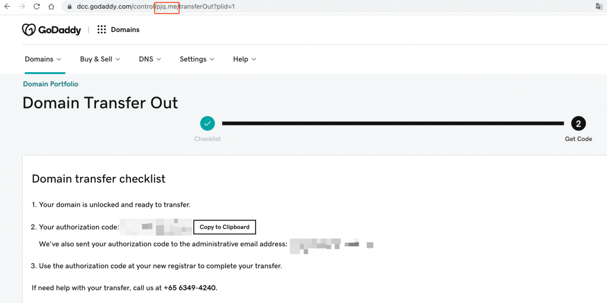
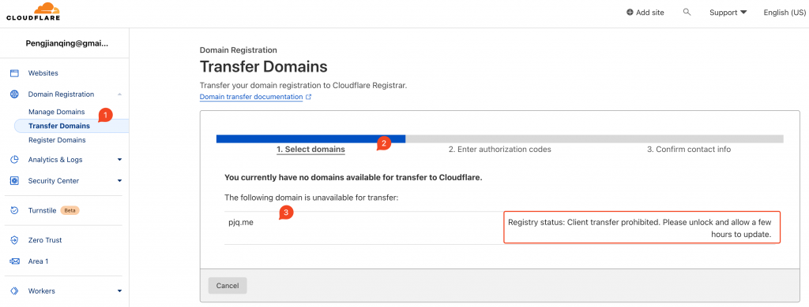
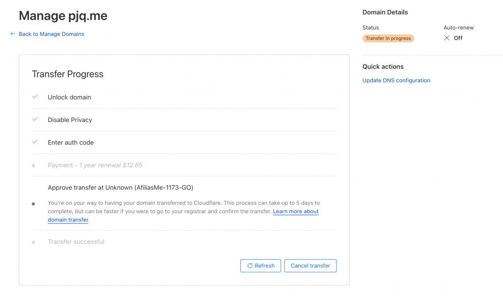
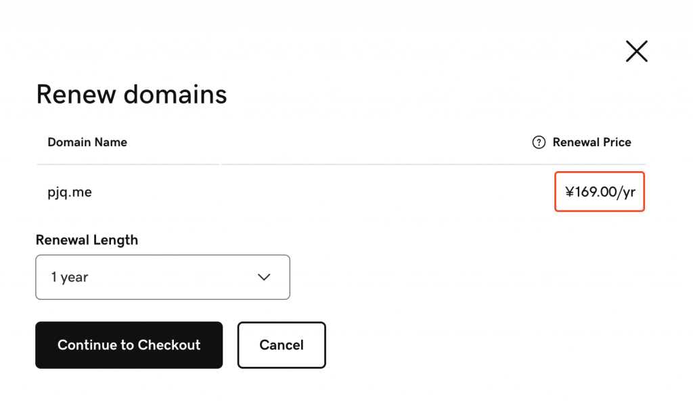

Refer the GoDaddy document

- [https://sg.godaddy.com/help/transfer-my-domain-away-from-godaddy-3560](https://sg.godaddy.com/help/transfer-my-domain-away-from-godaddy-3560)

Find the settings for you domain want to transfer

- [https://dcc.godaddy.com/control/portfolio/pjq.me/settings](https://dcc.godaddy.com/control/portfolio/pjq.me/settings)

In the CloudFlare, it says, so I need to wait for some time. 

> 

Registry status: Client transfer prohibited. Please unlock and allow a few hours to update.

And the status updated, so I need to add a payment method, and the cost is $12.85/year(vs GoDaddy ¥169.00/yr)

After I add the payment

Then it's DONE

And I can check the domain transfer status, it's still waiting for some process.

After I approve the transfer in the GoDaddy, then it finish the transfer, and it only need $12.85/year(CNY 88, GoDaddy is CNY 169)

To Compare, take the screenshot of GoDaddy.

