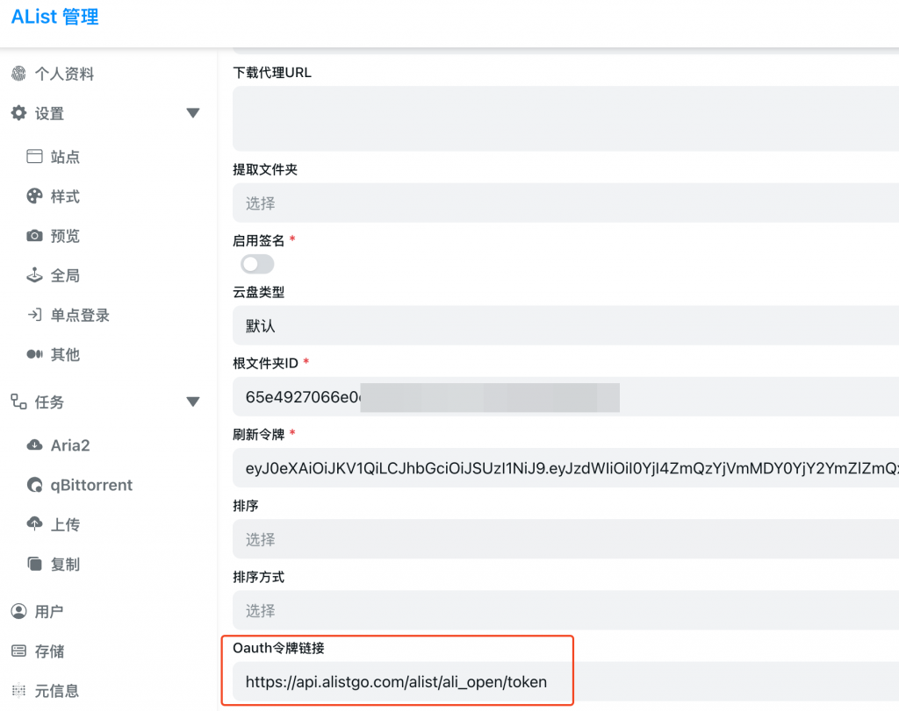

教程参考

- https://alistgo.com/zh/guide/drivers/aliyundrive_open.html

进入Alist管理后台，添加Aliyun open driver

- http://192.168.1.5:3010/

1.更新Oauth Token链接

- `https://api.alistgo.com/alist/ali_open/token`

2. 找到你想挂载的根文件夹ID, 比如, 当然我们可以直接填入"root"代表根目录

- https://www.alipan.com/drive/file/all/65e4927066e0cd78d3534717xxxxxxx

3. 获取refresh token, 打开这个链接，登录之后得到refresh token

- **[https://alistgo.com/zh/tool/aliyundrive/request](https://alistgo.com/zh/tool/aliyundrive/request)**

4.最终我们会得到webdav链接

- http://192.168.1.5:3010/dav

