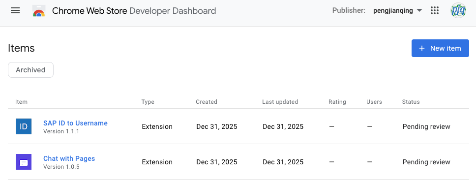

[09总结](https://pjq.me/?p=833)|[2](https://pjq.me/?p=833)[010年终总结](https://pjq.me/?p=898)|[2011年终总结](https://pjq.me/?p=993)|[2012年终总结](https://pjq.me/?p=1126)|[2013年终总结](https://pjq.me/?p=1249)|[2014年终总结|](https://pjq.me/?p=1280)[2015年终总结](https://pjq.me/?p=1318)[|](https://pjq.me/?p=1280)[2016年终总结](https://pjq.me/?p=1324)|[2017年终总结](https://pjq.me/?p=1355)|[2018年终总结](https://pjq.me/?p=1435)|[2019年终总结](https://pjq.me/?p=1523)|[再见2020](https://pjq.me/?p=1564)|[2021年终总结](https://pjq.me/?p=1619)|[2022年终总结](https://pjq.me/?p=1826)|[2023年终总结](https://pjq.me/?p=2148)|[2024年终总结](https://pjq.me/?p=2335)

今天又到了2025年最后一天，按照我的惯例，总归要写点什么，毕竟连载17年了。

数了一下今年的博客数量，17篇，可能是写的最多的一年了，常写常新。

如果要回顾过去一年，最让人印象深刻的，那就是AI飞速发展的一年，Vibe Coding深入人心。

今年也是裁员年，年初人心慌慌，再加上贸易战，各种地缘政治风险，世界感觉处于不稳定状态中。失业潮明年估计会来得更猛一些，再加上AI增效，随时也都会有被裁的风险，但这就是当前的常态，活在当下。

今年魔都房价下跌20%，去年下跌10%，2016年之后高价接盘侠，十年白干，很惨烈，大量房价抵不过贷款的，法拍的，断供的，一切如镜花水月，终竹篮打水一场空。所以年轻人，不结婚，不生娃，不买房，很多事情就自然解决了。

## AI

从之前的Cursor, Github Copilot, 到今年的Cline/Open Code/Claude Code，从年初的MCP到年尾的Skills, 各种编码工具，疯了似的迭代更新。

各种大语言模型今年也是轮着刷榜，从年初Deepseek横空出世，到Anthropic Claude Sonnet 4.5/OpenAI GPT-5.2/Google Gemini 3.0 Pro, Google图生模型Nano Banana Pro惊艳世界，AI浪潮就像波浪一样，一波一波的到来。

国产大语言模型也是卷的飞起，阿里Qwen/Kimi K2/GLM 4.7/Minimax 2.1/Doubao/Deepseek V3等等一堆大模型也是让人眼花缭乱。

当然我目前主力还是用的Claude Code + Sonnet 4.5。

我们无法预测AGI什么时候会到来，但今年一定是AI史上比较重要的一年，保持好奇心，持续跟进，不断偿试，而不要变成“老登”。

## 账单爆了

我一直觉得AI应该会像生活必须品一样的存在，所以我把AI比做自来水，大模型厂商就相当于自来水厂，从自来水厂，接到千家万户需要各种水管，所以我一直在做接水管的工作，让大家早点使用“自来水”， 现在每家水厂的水管型号都参数都不一样，所以我们需要做一个转接头，方便接入到每家每户。所以我一起在持续开发维护一个公司的LLM Proxy，好让大家能够用上"免费"无限的“自来水”

- https://github.com/pjq/sap-ai-core-llm-proxy

所以这个项目里面，我对接了MS Azure/AWS Bedrock/Google Vertex GenAI接口，这样可以用OpenAI/Claude兼容API模式接入到市面上的所有第三方应用，比如Lobe Chat/Cherry Studio/Chat Wise/Cline/Open Code/Codex/Cline/Claude Code。

于是我的帐单就爆了，查了一下今年的帐单，纯Token消耗费用达到了15000, 单位是欧元，相当于给组里每个同学都免费送了一个无限Token，无限使用次数的Claude Code，不用担心封号。当然我不知道后面会不会秋后算帐，等公司反应过来。

说到这里，其实我要感谢一下Github, 因为Github一直在免费赠送Github Copilot Pro帐号，每个月刷新一次，一直到现在都还在送，不用花钱就能得到一个满血版的Github Copilot Pro帐号。但Github Copilot的体验一言难尽，虽然公司在大力推Github Copilot，也给每个开发买了Github Copilot帐号，但我基本不用它。还坑的是公司买的虽然是企业版，但无法使用Claude的模型。

## 入坑IBKR

今年8月底趁着带娃去深圳，顺便去香港开通了港卡：中银香港，汇丰银行，众安银行，天星银行。每人每年的外汇额度也都用完了。也趁着最后一班末班车开通了美股券商盈透证券，嘉信理财，第一证券，并顺利入坑了QQQM/VGT，当前高位，只能坚持长期定投，10年后来看，希望是要来感谢现在的这个决定，当然也有可能被套在半山腰。

## 密码学Cryptography

今年继续公司为期三天密码学培训，这次没有偷懒，终于把去年一直想写的几篇文章写好了，也算是还愿了。

- [密码学(Cryptography)简史-古典密码学](https://pjq.me/?p=2461)

- [密码学(Cryptography)简史-对称加密(Symmetric Encryption)](https://pjq.me/?p=2474)

- [密码学(Cryptography)简史-非对称加秘(Asymmetric Encryption)](https://pjq.me/?p=2490) 

- [密码学(Cryptography)简史–后量子计算机时代你的数据还安全吗](https://pjq.me/?p=2505)

密码学这个涉及到的理论基础太多，只能是先学个形吧。

## 最后两天我在做什么

刚好昨天(2025/12/30)和今天在Vibe Coding两个Chrome Extension

- Chat with Pages: https://github.com/pjq/chrome-chat/

- SAP ID to Username https://github.com/pjq/sap-id2username

用Claude Code Vibe Coding的速度还是挺快的，这两个项目一个是用来解决我比较懒的问题，搜了一圈虽然也有很多类似的，但是很多时候网页内容涉及到个人隐私，不是太放心，这样可控性强，接入我写的LLM Proxy安全问题就完全解决了。另外一个是公司企业版Github上面经常只是显示用户id, 比如i123456, 而不是人名，之前虽然也有一个转换的插件，但貌似最近用不了，所以还不如自己写一个。

目前正在Chrome Web Store上架审核中

当然我之前没写过Chrome插件，昨天才想试试。若干年后，回头来看这些偿试，不知道会是怎样的感想。

其实最近一个月都是在感冒状态，好像以前从来没有过这么久，可能是接连感染了不同的病毒，好在现在好了，所以能蹦能跳，能跑能睡，就是最好的，其它都是浮云。今年也是一直在坚持跑步，只是最后这一两个月基本没怎么跑，今年暑假也是最热的一年，高温持续到10月多，感觉过不完的暑假。

最近年底了，还得了一个公司“TorchBearer”个人类别的一个什么奖。

## 2026

我们经历了移动互联网时代，现在又赶了AI时代，在整个人类历史进程中应该是比较重要的几个过程，所以有生之年是否真能见证AGI的实现？

2026年，我们又能看到AI的哪些巨大的变化？

2026年期待世界和平。